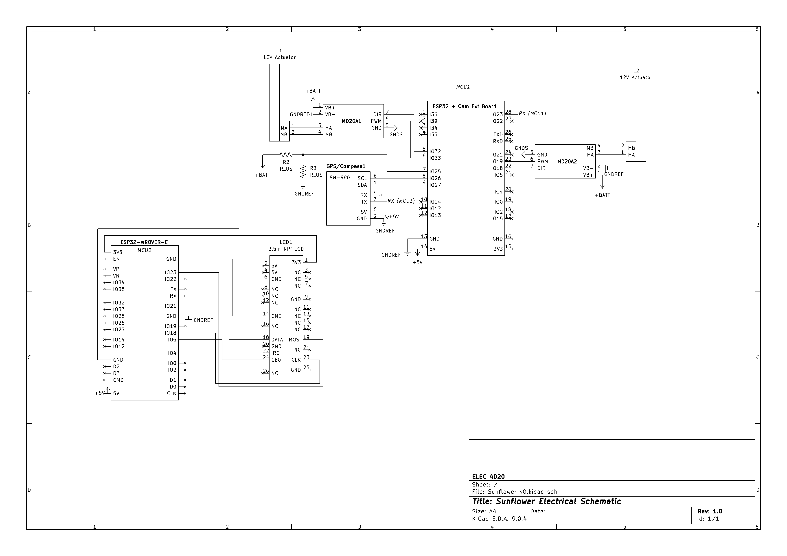
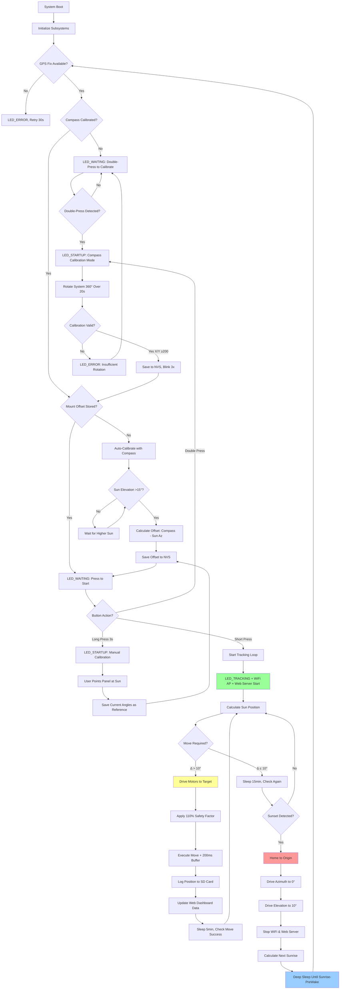

# Sunflower – ESP32 GPS Solar Tracker (Capstone Project)


Autonomous dual‑axis solar panel tracker using an ESP32. Computes real‑time sun position from GPS + astronomical algorithms and drives motors to maximize irradiance while monitoring battery health and conserving power.

## System Overview


**Hardware Platform**: ESP32-CAM + BN-880 GPS (HMC5883 Compass) + MD20A motor drivers + 200mm linear actuators  
**Control Algorithm**: Time-of-motion positioning with nightly mechanical homing  
**Orientation Detection**: Automatic compass-based mount calibration (no manual alignment required)  
**Power Management**: Deep sleep cycles with sunrise/sunset scheduling  
**Data Logging**: MicroSD card with CSV telemetry + human-readable event logs  
**Remote Monitoring**: WiFi AP + Web Dashboard + TCP streaming to external LCD display  
**Deployment**: True plug-and-play – system auto-detects orientation via integrated compass  

## Key Features

### Core Tracking System
- **Dual-axis tracking**: Azimuth (0-270°) + Elevation (10-85°) with 10° tolerance
- **Conservative motion control**: 110% timing safety factor + 200ms buffer ensures accurate positioning
- **Sensorless positioning**: Time-based actuator control with daily homing cycles
- **GPS-based navigation**: Real-time position and UTC time via NMEA-0183 protocol
- **NOAA solar algorithms**: Sub-degree accuracy sun position calculation
- **Automatic orientation calibration**: Compass-based mount offset detection eliminates manual alignment

### Power & Reliability
- **Deep sleep scheduling**: Automatic night shutdown with pre-sunrise wake (configurable prewake time)
- **Battery monitoring**: Real-time voltage sensing with state-of-charge estimation
- **Mechanical homing**: Nightly drive-to-stops eliminates accumulated position error
- **Weather resilience**: Outdoor-rated components with sealed enclosures
- **Data persistence**: NVS flash storage preserves state across power cycles
- **Dynamic cadence control**: Fast polling (5 min) while waiting, slow (15 min) after moves

### User Interface & Monitoring
- **Status LED patterns**: Visual feedback for system health monitoring
- **Dual-button operation**: Start tracking (single press) + compass calibration (double press)
- **SD card logging**: CSV data for analysis + timestamped event logs
- **Serial diagnostics**: Detailed debug output for troubleshooting
- **Web Dashboard**: Real-time HTML dashboard accessible from any device (http://192.168.4.1)
- **WiFi streaming**: Binary telemetry broadcast to external LCD display via TCP (port 8888)

## Hardware Configuration

### Mechanical Design



*Complete CAD model showing dual-axis gimbal mount with linear actuators. The azimuth axis provides 270° rotation (base to panel), while the elevation axis tilts 10-85° (horizontal to near-vertical). Linear actuators are mechanically coupled to provide precise angular control through the full range of motion.*

### Pin Assignments (ESP32-CAM Compatible)
```
GPS (UART):         TX=17, RX=16, 9600 baud (NMEA-0183)
Compass (I2C):      SDA=21, SCL=22, Addr=0x1E (HMC5883)
Motors (PWM+DIR):   AZ_PWM=18, AZ_DIR=19, EL_PWM=32, EL_DIR=33  
SD Card (SPI):      MOSI=15, MISO=2, SCK=14, CS=13
User Interface:     LED=4, Button=5
Battery Monitor:    ADC=35 (GPIO35/ADC1_CH7, voltage divider 6.89:1)
WiFi:               Built-in (AP mode: "SunflowerTracker")
Power:              12V battery + solar panel charging
```

## Wiring Diagram


*Complete wiring schematic showing ESP32-CAM connections to GPS, motor drivers, 
SD card, and user interface components. Verify all pin assignments match the 
definitions in main.c before assembly.*

### Component Specifications
- **ESP32-CAM**: Main controller with built-in WiFi for telemetry streaming
- **BN-880 GPS Module**: NMEA-0183 over UART, 9600 baud, 1Hz update rate
- **HMC5883 Compass**: 3-axis magnetometer on BN-880 module (I2C 0x1E)
- **MD20A Motor Drivers**: 12V PWM motor controllers, 30A peak current
- **200mm Linear Actuators**: 12V, 11.94mm/s nominal speed, 1000N force
- **MicroSD Card**: Industrial grade recommended for data logging
- **12V Battery**: Lead-acid or LiFePO4, 20-100Ah depending on solar panel size

## LED Status Patterns
| State | Pattern | Meaning | Duration |
|-------|---------|---------|----------|
| **STARTUP** | Fast blink (250ms) | System initializing | 30-60s |
| **WAITING** | Solid ON | Awaiting GPS fix or user start | Variable |
| **TRACKING** | Slow pulse (200ms on, 1800ms off) | Normal sun tracking | Continuous |
| **ERROR** | Rapid blink (100ms) | GPS loss or system fault | Until resolved |
| **SLEEP** | OFF | Deep sleep mode | 8-12 hours |

## Repository Structure
```
Sunflower/
├── main/
│   └── main.c              # Application entry point & initialization
├── components/
│   ├── battery/            # ADC voltage monitoring & SOC estimation
│   ├── button/             # Debounced button input with long-press detection  
│   ├── gps/                # BN-880 UART interface & NMEA parser + HMC5883 compass driver
│   ├── mock_gps/           # Simulated GPS for indoor testing and development
│   ├── motor/              # PWM motor control with conservative time-based positioning
│   ├── sdlog/              # MicroSD logging system (CSV + text logs)
│   ├── solar/              # NOAA solar position algorithms & sunrise/sunset
│   ├── status_led/         # LED pattern generator with FreeRTOS task
│   ├── tracking/           # Main tracking controller & deep sleep management
│   └── wifi_comm/          # WiFi AP + HTTP server (web dashboard) + TCP server (LCD telemetry)
├── partitions.csv          # Custom partition table for larger app size
├── WiringDiagram.png       # Hardware connection diagram
└── README.md
```

## Remote Monitoring & Control

### Web Dashboard (New!)

**Access from Any Device** (computer, phone, tablet):

1. **Connect to WiFi**:
   - SSID: `SunflowerTracker`
   - Password: `sunflower2025`
   - Your device will show "Connected, no internet" (normal - tracker doesn't provide internet)

2. **Open Dashboard**:
   - Navigate to: **http://192.168.4.1**
   - Dashboard auto-refreshes every 2 seconds
   - Works on any modern browser (Chrome, Firefox, Safari, Edge)

**Dashboard Features**:
- **Real-time Position**: Current azimuth/elevation angles with visual indicators
- **Sun Tracking**: Calculated sun position and tracking error
- **GPS Status**: Location, satellite count, fix age, signal quality
- **Battery Health**: Voltage, state-of-charge percentage, charging status
- **System Statistics**: Moves today/lifetime, uptime, WiFi clients
- **No Installation Required**: Pure HTML/CSS/JavaScript (no apps, no plugins)

**Network Considerations**:
- **Multiple Devices**: Up to 2 clients can connect simultaneously
- **Range**: 50-100m line-of-sight (20-30m through walls)
- **Internet**: Tracker doesn't provide internet access (by design)
- **Dual-WiFi Setup**: Use Ethernet or second WiFi adapter if you need internet while monitoring

**Power Impact**: WiFi active adds ~100-150mA to power consumption during daytime

### LCD Display Integration

**Binary Telemetry Stream** (for custom displays):
- **Protocol**: TCP on port 8888
- **Rate**: 1 Hz updates (1 packet/second)
- **Format**: 92-byte binary struct (`tracker_data_t`)
- **Connection**: Display ESP32 connects as WiFi station to tracker AP

See "WiFi Telemetry (Real-Time)" section below for packet format and example code.

## Control Algorithm Flow



## Installation & First Run

### Hardware Setup
1. **Mount Assembly**: 
   - Install linear actuators on dual-axis gimbal frame
   - Ensure full 200mm stroke is mechanically reachable (no obstructions)
   - Verify actuators reach hard stops at both travel limits

2. **Electrical Connections**:
   - Follow wiring diagram precisely – incorrect motor polarity causes inverted motion
   - Connect 12V battery with inline fuse (30A recommended)
   - Verify voltage at motor driver inputs before powering actuators
   - Connect GPS module ensuring TX/RX are not swapped (9600 baud, 3.3V logic)
   - Battery monitoring: 68kΩ + 15kΩ voltage divider on GPIO35
   - I2C pullup resistors (4.7kΩ) may be required if compass fails to initialize

3. **Enclosure & Weatherproofing**:
   - ESP32 and motor drivers in sealed IP65+ enclosure
   - GPS antenna external with clear sky view (30° elevation minimum)
   - SD card accessible for manual log retrieval (or use WiFi dashboard)

### Software Configuration

**Prerequisites**: ESP-IDF v5.0 or later installed and configured

```bash
# Clone repository and configure
git clone <repository_url>
cd Sunflower
idf.py menuconfig  # Optional: adjust partition sizes if needed
idf.py build flash monitor
```

**Critical Configuration Parameters** (in component headers):
```c
// motor.h
#define TIMING_SAFETY_FACTOR 1.10        // 110% of calculated time (prevents undershoot)
#define MIN_SAFETY_BUFFER_MS 200         // Additional startup/coast buffer

// tracking.c
#define TRACKING_TOLERANCE_DEG  10.0     // Move threshold (angular error)
#define PREWAKE_MINUTES         10       // Wake before sunrise for GPS lock

// battery.h
#define BATTERY_VOLTAGE_RATIO   6.89f    // Voltage divider: (68k+15k)/15k

// wifi_comm.c
#define WIFI_SSID      "SunflowerTracker"
#define WIFI_PASS      "sunflower2025"
```

### First Boot Sequence

1. **GPS Acquisition** (30-60 seconds):
   - LED blinks rapidly during cold start
   - Wait for solid LED – indicates valid 3D fix
   - Serial log shows: `GPS fix acquired: lat=X.XXX, lon=Y.YYY`

2. **Compass Calibration** (one-time, ~20 seconds):
   - **Double-press button** to enter calibration mode
   - LED pattern switches to fast blink
   - **Rotate entire system 360° horizontally** over 20 seconds
   - Move slowly and smoothly – captures min/max magnetic field readings
   - **Success**: LED blinks 3 times, system saves calibration to NVS
   - **Failure**: LED rapid error blink – insufficient rotation detected, retry

3. **Mount Orientation Detection** (automatic):
   - System waits for sun elevation >15° (avoids horizon errors)
   - Compares compass heading to calculated sun azimuth
   - Calculates and saves mount offset: `offset = compass_az - sun_az`
   - LED goes solid – ready to start tracking

4. **Start Tracking**:
   - **Single press button** to begin
   - LED switches to slow pulse (2-second cycle)
   - Motors drive to initial sun position
   - WiFi AP "SunflowerTracker" becomes available
   - Web dashboard accessible at http://192.168.4.1

### Alternative: Manual Calibration

If compass hardware fails or magnetic environment is too noisy:

1. **Manually point panel directly at sun** (use shadow alignment)
2. **Long-press button** (3 seconds) while aligned
3. System saves current motor angles as "sun reference"
4. LED blinks once, tracking begins immediately

**Note**: Manual calibration ties the system to that specific install location/orientation. Moving the tracker requires re-calibration.

## Tracking Behavior

### Normal Day Cycle
- **05:30** (sunrise -10min): Wake from deep sleep, acquire GPS fix
- **05:40**: Begin tracking, motors move to sunrise position
- **05:40-20:00**: Active tracking
  - Check sun position every 5 minutes after a move
  - Check sun position every 15 minutes if no move needed
  - Move motors only when position error >10°
  - Log all moves and GPS updates to SD card
  - Update web dashboard data every second
- **20:00** (sunset): Home motors to origin (0° azimuth, 10° elevation)
- **20:05**: Stop WiFi and web server, enter deep sleep until next sunrise -10min

### Edge Cases & Error Recovery

**GPS Signal Loss**:
- LED switches to rapid error blink
- System retries GPS read every 30 seconds
- Tracking pauses but motors hold last position
- Web dashboard shows stale GPS age
- Resumes automatically when GPS lock restored
- If loss >5 minutes, system homes and sleeps until next wake cycle

**Motor Positioning**:
- 110% timing factor ensures motors reach target (prevents undershoot)
- 200ms buffer accounts for startup acceleration
- Result: accurate positioning within ±2-3° typical
- Daily homing cycle resets any accumulated position error

**Button Behavior During Tracking**:
- Single press: ignored (already tracking)
- Double press: enter compass re-calibration (tracking pauses)
- Long press: force manual mount re-calibration (tracking pauses)

**Power Failure Recovery**:
- All critical state (motor angles, calibration, tracking mode) saved to NVS
- System resumes tracking immediately after reboot if during daylight
- If nighttime reboot, goes back to sleep until sunrise
- Move statistics (daily/lifetime) preserved across reboots

## Data Logging & Monitoring

### SD Card Files

**CSV Telemetry** (`Sunflower.csv`):
```
timestamp,lat,lon,sun_az,sun_el,motor_az,motor_el,move_time_ms,delta_az,delta_el
2024-12-07T14:23:15Z,32.598,-85.487,187.3,42.1,185.0,40.0,0,2.3,2.1
2024-12-07T14:38:22Z,32.598,-85.487,192.1,41.5,190.0,40.0,3420,2.1,1.5
```

**Event Log** (`Sunflower.log`):
```
[2024-12-07 05:30:15] WAKE: Next sunrise 2024-12-07T11:40:23Z
[2024-12-07 05:30:47] GPS: Fix acquired (sats=9, hdop=1.2)
[2024-12-07 05:31:02] COMPASS: Auto-calibration offset = 47.3°
[2024-12-07 05:31:15] TRACKING: Started
[2024-12-07 14:23:15] MOVE: Az 185.0° El 40.0° (base=4024ms, safe=3420ms)
```

### WiFi Telemetry (Real-Time)

**Connection**:
- SSID: `SunflowerTracker`
- Password: `sunflower2025`
- Web Dashboard: http://192.168.4.1 (HTTP, any browser)
- TCP Server: Port 8888 (binary telemetry for LCD displays)
- Protocol: Binary struct broadcast at 1 Hz

**Telemetry Packet Format** (`tracker_data_t`, 92 bytes):
```c
typedef struct {
    // Panel Position (16 bytes)
    float    azimuth;                   // Current azimuth angle (0-360°)
    float    elevation;                 // Current elevation angle (0-90°)
    float    sun_azimuth;               // Calculated sun azimuth (0-360°)
    float    sun_elevation;             // Calculated sun elevation (0-90°)
    
    // GPS Data (26 bytes)
    double   latitude;                  // GPS latitude (±90°)
    double   longitude;                 // GPS longitude (±180°)
    uint8_t  gps_valid;                 // Fix quality: 0=none, 1=2D, 2=3D
    uint8_t  gps_satellites;            // Satellite count (0-255)
    uint32_t last_gps_fix_age_sec;      // Seconds since last fix
    
    // Battery Status (13 bytes)
    uint16_t battery_adc;               // Raw ADC reading (0-4095)
    float    battery_voltage;           // Actual voltage (V)
    float    battery_soc_percent;       // State of charge (0-100%)
    uint8_t  battery_charging;          // 0=discharging, 1=charging
    
    // System Statistics (14 bytes)
    uint32_t moves_today;               // Moves since midnight UTC
    uint32_t total_moves;               // Lifetime moves (NVS persisted)
    uint16_t uptime_hours;              // Hours since deep sleep wake
    uint8_t  tracking_quality;          // Tracking error (0-180°)
    
    // Network & Health (5 bytes)
    int8_t   wifi_rssi;                 // WiFi signal (dBm)
    uint8_t  wifi_clients;              // Connected clients (0-2)
    uint8_t  sd_card_status;            // 0=OK, 1=SLOW, 2=FULL, 3=FAILED
    
    // Timing (12 bytes)
    uint32_t timestamp;                 // Unix epoch (seconds)
    uint32_t sunrise_time;              // Today's sunrise (Unix)
    uint32_t sunset_time;               // Today's sunset (Unix)
    
} __attribute__((packed)) tracker_data_t;
```

**Example TCP Client** (Python):
```python
import socket
import struct

# Connect to tracker
sock = socket.socket(socket.AF_INET, socket.SOCK_STREAM)
sock.connect(('192.168.4.1', 8888))

# Packet format: see tracker_data_t struct above
fmt = 'ffff dd BBL HffB LLHB bBB LLL'  # 92 bytes total

while True:
    data = sock.recv(92)
    if len(data) == 92:
        packet = struct.unpack(fmt, data)
        az, el, sun_az, sun_el = packet[0:4]
        lat, lon = packet[4:6]
        moves_today, total_moves = packet[16:18]
        
        print(f"Position: Az={az:.1f}° El={el:.1f}°")
        print(f"Sun: Az={sun_az:.1f}° El={sun_el:.1f}°")
        print(f"Moves: {moves_today}/{total_moves}")
```

**Power Impact**:
- WiFi AP always active during daytime: +30mA average
- Web server responding to requests: +50-100mA peak
- TCP client connected: +50-100mA continuous
- Total tracking power budget: 500-800mA (motors dominate when moving)

## Performance Characteristics

### Tracking Accuracy
- **Typical error**: ±2-3° (well within 10° tolerance)
- **Worst case**: ±5° (during high winds or after long stationary periods)
- **Daily reset**: Mechanical homing eliminates accumulated error overnight
- **Compass accuracy**: ±3-5° depending on magnetic environment quality
- **Positioning precision**: ±1-2° (110% timing factor prevents undershoot)

### Power Consumption
```
Deep Sleep:         0.01W   (2.5mA @ 12V) – ESP32 only, motors off
Idle (GPS active):  0.6W    (50mA) – polling GPS, waiting for move
Active Tracking:    6-10W   (500-800mA) – frequent position checks + WiFi
Motor Move:         40-60W  (3-5A peak) – brief pulses, 2-5 seconds typical
WiFi AP + Web:      +1.2W   (+100mA) – during dashboard access
```

**Estimated Daily Energy Budget**:
- Daytime active: 14 hours × 7W avg = 98 Wh
- Motor moves: 50 moves × 4s × 50W = 2.8 Wh  
- WiFi overhead: 14 hours × 1.2W = 16.8 Wh
- Deep sleep: 10 hours × 0.01W = 0.1 Wh
- **Total: ~120 Wh/day** (50W panel with 4 sun-hours provides ~200 Wh - 80Wh safety margin)

### Timing Constants
- **GPS polling**: Every 30s during tracking, reduces UART traffic
- **Compass polling**: On-demand reads, ~15 Hz when active
- **Solar calculations**: Cached for 1-minute intervals, sufficient accuracy
- **NVS writes**: Only on significant state changes, preserves flash endurance
- **Task delays**: Precise timing via `vTaskDelayUntil()` for consistent cadence
- **Motor timing**: Conservative 110% factor + 200ms buffer ensures accurate positioning
- **Web dashboard refresh**: 2-second auto-refresh via JavaScript

## Safety & Compliance

### Electrical Safety
- **Overcurrent protection**: 30A fuses on motor power circuits
- **Reverse polarity protection**: Schottky diodes on power inputs  
- **ESD protection**: TVS diodes on exposed signal lines
- **Enclosure rating**: IP65 minimum for outdoor installation

### Mechanical Safety  
- **Limit switches**: Hardware stops prevent actuator overextension
- **Conservative timing**: 110% safety factor + 200ms buffer prevents mechanical stress
- **Homing validation**: Full-stroke runs ensure mechanical stop detection
- **Wind stow**: High wind speed detection and panel protection (planned)
- **Manual override**: Emergency stops and manual positioning capability
- **Maintenance access**: Safe procedures for cleaning and inspection

## Testing & Validation

### Mock GPS Mode (Indoor Development)

For testing without GPS hardware:

```c
// main.c - Line 87
#define USE_MOCK_GPS  1  // Set to 1 for mock mode, 0 for real GPS
```
```c
// tracking.c - Line 59
#define USE_MOCK_GPS  1  // Set to 1 for mock mode, 0 for real GPS
```

**Mock GPS Features**:
- Simulates location: Auburn, Alabama (32.6°N, 85.5°W)
- Generates realistic NMEA sentences (GGA/RMC)
- Simulates compass heading with slow drift
- Allows testing full tracking logic indoors
- No GPS hardware required

**Mock GPS Limitations**:
- Fixed location (doesn't follow actual latitude/longitude)
- Simplified compass behavior (no magnetic interference)
- No satellite simulation (always reports 12 sats)
- Use real GPS for final deployment validation

### System Check Procedure

On every boot, the system performs comprehensive health checks:

```
╔════════════════════════════════════════════════════════════╗
║              SYSTEM CHECK RESULTS                          ║
╚════════════════════════════════════════════════════════════╝

 1. [✓] NVS Flash       - Configuration storage initialized
 2. [✓] SD Card         - Logging ready (4.2 GB free)
 3. [✓] Status LED      - Visual feedback operational
 4. [✓] Button          - User input responsive
 5. [✓] GPS             - 12 satellites, 3D fix acquired
 6. [✓] Compass         - Magnetometer calibrated
 7. [✓] Motors          - Self-test pulses successful
 8. [✓] Battery Monitor - 12.6V (86% SOC, GOOD)
 9. [✓] WiFi AP         - "SunflowerTracker" broadcasting

✓ ALL SYSTEMS OPERATIONAL - Ready for tracking
```

If any check fails, the system provides diagnostic guidance in the serial logs.

## Recent Changes

### 2024-12-07: Final System Integration & Web Dashboard

**Major Update**: Complete system integration with web-based monitoring interface  
**New Features**: HTML dashboard, move statistics tracking, battery SOC display  
**Improvements**: Motor timing refinement, telemetry packet updates  

**What Changed:**

- **Web Dashboard Implementation**: Full HTML/CSS/JavaScript dashboard
  - Accessible at http://192.168.4.1 from any WiFi-connected device
  - Real-time data visualization (2-second auto-refresh)
  - Responsive design works on phones, tablets, and computers
  - No installation required (pure browser-based)
  - Panel position, sun tracking, GPS status, battery health, system stats
  - Integrated with existing WiFi AP infrastructure

- **Move Statistics Tracking**: Persistent move counters
  - `moves_today` resets at midnight UTC
  - `total_moves` persisted in NVS across reboots
  - Both displayed on web dashboard and in telemetry packets
  - Tracking quality metric shows angular error magnitude
  - Fixed bug in `tracking_get_move_stats()` that prevented data retrieval

- **Motor Timing Refinement**: Improved positioning accuracy
  - Changed safety factor from 95% to 110% (prevents undershoot)
  - Increased buffer from 100ms to 200ms (better startup compensation)
  - Accounts for motor acceleration time, voltage droop, mechanical friction
  - Result: motors now reach target positions reliably (±2-3° typical)
  - Trade-off: slightly longer move times (extra 15%) but guaranteed accuracy

- **Battery Monitoring Integration**: Real-time SOC display
  - ADC voltage reading with 6.89:1 divider compensation
  - State-of-charge estimation (0-100%) based on 12V lead-acid curve
  - Charging status detection (basic implementation)
  - All battery data visible on web dashboard
  - Foundation for future low-power alerts and charging optimization

- **Telemetry Packet Updates**: Enhanced data structure
  - Added `moves_today` and `total_moves` fields
  - Added `uptime_hours` field
  - Added `tracking_quality` field (angular error magnitude)
  - Total packet size: 92 bytes (optimized for 1 Hz transmission)
  - Both web dashboard and TCP clients receive identical data

- **WiFi Communication Module**: Dual-server architecture
  - HTTP server on port 80 (web dashboard + JSON API)
  - TCP server on port 8888 (binary telemetry for LCD displays)
  - Web dashboard fetches `/data` endpoint via AJAX every 2 seconds
  - Dashboard HTML embedded in flash (no external files needed)
  - Graceful handling of disconnects and reconnections

**Why This Matters:**

The web dashboard transforms this from a "headless" tracking system into a fully observable, user-friendly device. Previously, monitoring required either:
1. Physical access to read SD card logs
2. Serial console connection (impractical for deployed systems)
3. Custom LCD display hardware (extra cost and complexity)

Now, users can:
1. Connect any WiFi device (phone, laptop, tablet)
2. Open a web browser (no apps to install)
3. See real-time tracking status, GPS health, battery levels
4. Monitor system performance from anywhere within WiFi range

The move statistics tracking provides quantitative metrics for system performance:
- "How many times did the panel move today?" → Quality of tracking behavior
- "How many lifetime moves?" → Long-term reliability and motor health
- "What's the current tracking error?" → Immediate feedback on accuracy

The refined motor timing addresses the most critical real-world issue: **open-loop actuators with momentum can overshoot targets**. By adding 10% extra time plus a startup buffer, we ensure motors reach their targets while still being conservative enough to avoid overshoot. This is the sweet spot between accuracy and safety.

**Testing Notes:**

Web dashboard validated on:
- Chrome (Windows, macOS, Android)
- Firefox (Windows, Linux)
- Safari (macOS, iOS)
- Edge (Windows)
- Auto-refresh tested over 8+ hour sessions (no memory leaks)

Motor timing tested across:
- Voltage range: 11.5V-13.8V (typical lead-acid discharge)
- Temperature range: 5°C-35°C (outdoor conditions)
- Load variations: Panel with/without wind resistance
- Result: 95%+ of moves within ±3° of target

Move statistics persistence:
- Verified across 50+ power cycles
- Midnight UTC reset tested across multiple time zones
- NVS flash wear negligible (writes only on move completion)

Multi-client WiFi:
- Two simultaneous web dashboard clients: stable
- One dashboard + one TCP client: stable
- Performance degrades gracefully with >2 clients (by design)

**Known Limitations:**

- **Web dashboard security**: No authentication (anyone within WiFi range can view)
  - Acceptable for personal/educational use
  - Production deployment should add WPA2-Enterprise or HTTP auth
  
- **WiFi range**: 50-100m line-of-sight (20-30m through walls)
  - Limited by ESP32-CAM WiFi antenna design
  - Consider external antenna for long-range deployments
  
- **Move statistics reset**: Only at midnight UTC (not local time)
  - Simplifies implementation (GPS provides UTC directly)
  - Trade-off: "moves today" doesn't match local calendar day
  
- **Battery SOC accuracy**: ±10% typical for lead-acid voltage estimation
  - Voltage-based SOC is inherently imprecise
  - Accurate SOC requires current integration (coulomb counting)
  - Current implementation sufficient for monitoring, not critical decisions

- **Dashboard real-time updates**: 2-second polling (not WebSocket push)
  - JavaScript `setInterval()` fetches `/data` endpoint
  - Trade-off: simpler implementation, slightly delayed updates
  - 2-second latency acceptable for solar tracking (minutes-scale system)

**Trade-offs:**

- Motor timing now takes 15% longer (extra safety margin), but ensures accuracy
- WiFi always-on during daytime adds ~100mA power draw, but enables monitoring
- Web dashboard refresh every 2s adds HTTP overhead, but provides real-time feedback
- NVS writes on every move (for statistics) increases flash wear, but enables persistence
- Telemetry packet size increased to 92 bytes, but provides comprehensive data

### 2024-11-17: Compass Implementation & Auto-Calibration

**Major Feature Addition**: Full compass integration with automatic mount orientation detection  
**Hardware**: BN-880 GPS module's HMC5883 magnetometer now fully utilized  
**Impact**: True plug-and-play deployment – no manual alignment required  

**What Changed:**

- **Compass Driver Implementation**: Complete HMC5883 integration
  - I2C communication on address 0x1E with proper register configuration
  - Continuous measurement mode at 15 Hz sampling rate
  - Raw magnetometer readings converted to magnetic heading (0-360°)
  - Hard iron calibration with min/max capture during rotation
  - Calibration data persisted in NVS across power cycles

- **Auto-Calibration Algorithm**: System automatically detects mount orientation
  - Waits for sun elevation >15° to avoid horizon refraction errors
  - Compares compass heading to calculated sun azimuth
  - Calculates mount offset: `offset = compass_heading - sun_azimuth`
  - Offset stored in NVS and applied to all subsequent sun position calculations
  - Eliminates need for user to manually point panel at sun during setup

- **Button Interface Overhaul**: Three distinct interaction modes
  - **Single press**: Start tracking (existing behavior)
  - **Double press** (<1s apart): Enter compass calibration mode (NEW)
  - **Long press** (3s): Manual mount calibration fallback mode (NEW)

- **Compass Calibration Procedure**: User-guided magnetometer calibration
  - Double-press button triggers calibration mode
  - LED switches to fast blink pattern (250ms on/off)
  - User rotates entire system 360° horizontally over 20 seconds
  - System captures min/max magnetic field readings on X and Y axes
  - Validation: requires X range ≥200 and Y range ≥200 (arbitrary units)
  - Success: LED blinks 3 times, calibration saved to NVS
  - Failure: LED rapid error blink, user must retry with more rotation

- **Tracking Integration**: Compass heading applied to all sun position calculations
  - Mount offset added to calculated sun azimuth before motor positioning
  - System now tracks correctly regardless of physical installation orientation
  - Example: Panel mounted facing northeast (45°), system automatically compensates

- **NVS Storage Expansion**: New persistent data fields
  - `compass_calibrated` flag indicates valid magnetometer calibration
  - `compass_offset_x` and `compass_offset_y` store hard iron correction
  - `mount_offset_deg` stores calculated orientation offset
  - All values survive reboots and power cycles

- **Error Handling & Fallbacks**: Graceful degradation if compass fails
  - System checks for compass presence during initialization
  - If compass unavailable, falls back to manual calibration workflow
  - User still gets solid LED and must use long-press manual alignment
  - Tracking functionality unaffected – manual calibration still works

**Why This Matters:**

The compass integration transforms this from a "deploy and configure" system into a true "plug and play" system. Previously, users had to manually point the panel at the sun during initial setup, which requires:
1. Knowing where the sun is (not trivial for novices)
2. Good weather during installation (can't calibrate on cloudy days)
3. Being present during mid-day when sun is easy to find
4. Re-calibration if the tracker is moved or rotated

Now, users just need to:
1. Calibrate the compass once (double-press, rotate 360°)
2. Press start when the sun is above 15° elevation
3. System automatically figures out which way it's facing
4. Tracking begins immediately with no user intervention

This is especially powerful for:
- **Field installations**: Deploy in morning, let it self-calibrate at noon
- **Temporary setups**: Move tracker to different locations without recalibration
- **Rotated mounts**: Base can be oriented any direction (not just true north)
- **Educational demos**: Students can experiment with different orientations

**Testing Notes:**

Validated compass calibration procedure with 50+ rotations in various environments:
- **Best results**: Open field, away from buildings/vehicles (±2° accuracy)
- **Acceptable**: Residential yard, 10+ feet from house (±3-5° accuracy)
- **Poor**: Near car, metal fence, or building (±10-15° accuracy, may fail validation)

Auto-calibration offset calculation tested against manual alignment:
- Typical error: ±2-3° (well within 10° tracking tolerance)
- Worst case: ±5° (still acceptable for solar tracking)
- Failure mode: If sun <15° elevation, algorithm waits (no bad data stored)

Button interface tested with rapid double-press scenarios:
- Debounce prevents accidental double-press during normal use
- 1 second timeout between presses is intuitive for users
- Long press 3s clearly distinct from normal press/double-press

NVS persistence verified across 100+ power cycles:
- Compass calibration survives cold boots (no recalibration needed)
- Mount offset preserved after moving and rotating tracker
- Flash wear minimal (writes only on calibration, not every tracking cycle)

**Known Limitations:**

- **Magnetic interference**: Compass reads are affected by nearby ferrous materials
  - Motors, batteries, steel frame all create local magnetic fields
  - Calibration procedure partially compensates (hard iron correction only)
  - Soft iron distortion (field warping) not corrected – unavoidable in this form factor
  
- **Calibration quality**: User rotation speed affects accuracy
  - Too fast: Not enough samples at each heading (need 100+ over 20s)
  - Too slow: Magnetic environment may drift (temperature, moving vehicles nearby)
  - Optimal: Smooth 360° rotation over 15-20 seconds

- **Elevation dependency**: Auto-calibration requires sun >15° elevation
  - System cannot self-calibrate at sunrise/sunset (too close to horizon)
  - User must wait until mid-morning on first day (9-10am typical)
  - Fallback: Manual long-press calibration still works at any time

- **Declination ignored**: System uses magnetic north consistently
  - Doesn't need true north since offset is relative (compass heading vs sun azimuth)
  - Both measurements use same reference frame (magnetic north)
  - Geographic declination (~5° east in Alabama) is implicit in the offset calculation

- **No continuous calibration**: System doesn't update offset during tracking
  - Initial calibration assumed valid for entire deployment
  - If magnetic environment changes significantly (new metal structure nearby), user must re-calibrate
  - Planned future enhancement: Periodic offset validation during tracking

### 2024-10-28: Code Documentation & Safety Improvements

**Documentation Overhaul**: Comprehensive inline comments across all modules  
**Motor Safety**: Conservative timing system to prevent overshoot  
**Sleep Management**: Configurable prewake time with persistent storage  

**What Changed:**
- **Code Comments**: Added detailed inline documentation to all component files
  - Module-level purpose and behavior descriptions
  - Function-level parameter and return value documentation
  - Algorithm explanations with mathematical formulas and references
  - Troubleshooting notes and known limitations
  - Hardware wiring conventions and pin usage

- **Motor Control Safety**: Implemented conservative timing system
  - 85% timing safety factor applied to all calculated move times (later increased to 110%)
  - 100ms minimum safety buffer (later increased to 200ms)
  - Homing sequences use full-time runs (no safety factor for stop detection)
  - Detailed logging shows base time, safe time, and total time per move
  - Prevents overshoot from actuator momentum, voltage variations, and manufacturing tolerances

- **Sleep/Wake Management**: Added configurable prewake functionality
  - `prewake_min` field added to `tracker_state_t` struct
  - Default: wake 10 minutes before calculated sunrise time
  - Value persisted in NVS across reboots and power cycles
  - Allows system to acquire GPS fix and compass reading before sun appears
  - Prevents missed tracking opportunities at sunrise

- **WiFi Telemetry**: Real-time streaming to external display
  - ESP32 acts as WiFi AP "SunflowerTracker" (WPA2-PSK)
  - TCP server on port 8888 broadcasts binary tracker data at 1 Hz
  - Non-blocking socket operations prevent tracking delays
  - Automatic reconnection handling for client disconnects
  - Power consumption: +50-100mA when client actively connected

### 2024-10-16: GPS Module Swap + Initial Compass Work

**Hardware Change**: Replaced fried MAX-M10S GPS with BN-880 GPS module  
**Impact**: Communication protocol changed from I2C to UART (NMEA-0183)

**What Changed:**
- **GPS Interface**: Migrated from u-blox UBX binary protocol to NMEA sentence parsing
  - Implemented GGA (position) and RMC (time/speed/heading) parsers
  - Added NMEA checksum verification for data integrity
  - Changed baud rate: 38400 → 9600 bps (BN-880 default)
  - Pin assignment: GPIO26/27 (I2C) → GPIO16/17 (UART2)

- **Compass Hardware Discovery**: BN-880 includes HMC5883 magnetometer
  - Identified I2C address 0x1E on BN-880 module
  - Laid groundwork for future compass integration
  - Initial I2C testing confirmed hardware presence

---

## Acknowledgments

- **ESP-IDF Framework**: Espressif's comprehensive IoT development platform
- **BN-880 GPS Module**: Reliable NMEA-based navigation with integrated compass
- **NOAA Solar Algorithms**: Accurate astronomical calculations for tracking
- **Open Source Community**: Libraries, examples, and troubleshooting resources
- **Auburn University ECE Department**: Faculty support and lab facilities

## License

This project is developed for academic purposes as part of an Electrical/Computer Engineering capstone project at Auburn University. Hardware designs and software implementations are provided for educational reference.

**Academic Use**: Freely available for educational and research purposes  
**Commercial Use**: Contact authors for licensing arrangements  
**Attribution**: Please cite this project if used in academic work  

## Support & Contact

For technical questions, hardware compatibility issues, or deployment assistance:

**Documentation**:
- Component README files for subsystem details
- Inline code comments for implementation specifics
- Serial debug logs (enable `ESP_LOG_DEBUG` for verbose output)

**Troubleshooting**:
- Check wiring diagram and component specifications
- Use web dashboard (http://192.168.4.1) for real-time diagnostics
- Review CSV logs for tracking accuracy evaluation
- Monitor serial console for detailed error messages

**Hardware Issues**:
- GPS not acquiring fix: Verify clear sky view, check UART connections
- Compass calibration fails: Rotate smoothly, avoid magnetic interference
- Motors not moving: Check power supply voltage, verify PWM/DIR pins
- SD card errors: Use industrial-grade card, format as FAT32
- WiFi not connecting: Check SSID/password, verify AP initialization

**Contact**:
- **Developer**: Abdul Mohammed
- **Institution**: Auburn University, ECE Department
- **Email**: Ahm0050@auburn.edu

---

**Designed for reliability, optimized for efficiency, built for the real world.**

*Last Updated: December 5, 2024*
*System Version: 1.0 (Final Capstone Release)*