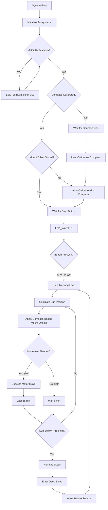

# Sunflower – ESP32 GPS Solar Tracker (Capstone Project)


Autonomous dual‑axis solar panel tracker using an ESP32. Computes real‑time sun position from GPS + astronomical algorithms and drives motors to maximize irradiance while monitoring battery health and conserving power.

## System Overview


**Hardware Platform**: ESP32-CAM + BN-880 GPS (HMC5883 Compass) + MD20A motor drivers + 200mm linear actuators  
**Control Algorithm**: Time-of-motion positioning with nightly mechanical homing  
**Orientation Detection**: Automatic compass-based mount calibration (no manual alignment required)  
**Power Management**: Deep sleep cycles with sunrise/sunset scheduling  
**Data Logging**: MicroSD card with CSV telemetry + human-readable event logs  
**Deployment**: True plug-and-play – system auto-detects orientation via integrated compass  

## Key Features

### Core Tracking System
- **Dual-axis tracking**: Azimuth (0-270°) + Elevation (10-85°) with 10° tolerance
- **Sensorless positioning**: Time-based actuator control with daily homing cycles
- **GPS-based navigation**: Real-time position and UTC time via NMEA-0183 protocol
- **NOAA solar algorithms**: Sub-degree accuracy sun position calculation
- **Automatic orientation calibration**: Compass-based mount offset detection eliminates manual alignment

### Power & Reliability
- **Deep sleep scheduling**: Automatic night shutdown with pre-sunrise wake
- **Battery monitoring**: Voltage sensing with low-power alerts (planned)
- **Mechanical homing**: Nightly drive-to-stops eliminates accumulated position error
- **Weather resilience**: Outdoor-rated components with sealed enclosures
- **Data persistence**: NVS flash storage preserves state across power cycles

### User Interface & Monitoring
- **Status LED patterns**: Visual feedback for remote system health monitoring
- **Dual-button operation**: Start tracking (single press) + compass calibration (double press)
- **SD card logging**: CSV data for analysis + timestamped event logs
- **Serial diagnostics**: Detailed debug output for troubleshooting

## Hardware Configuration

### Pin Assignments (ESP32-CAM Compatible)
```
GPS (UART):         TX=17, RX=16, 9600 baud (NMEA-0183)
Compass (I2C):      SDA=21, SCL=22, Addr=0x1E (HMC5883)
Motors (PWM+DIR):   AZ_PWM=32, AZ_DIR=33, EL_PWM=18, EL_DIR=19  
SD Card (SPI):      MOSI=15, MISO=2, SCK=14, CS=13
User Interface:     LED=4, Button=5
Power:              12V battery + solar panel charging
```

## Wiring Diagram


*Complete wiring schematic showing ESP32-CAM connections to GPS, motor drivers, 
SD card, and user interface components. Verify all pin assignments match the 
definitions in main.c before assembly.*

### Component Specifications
- **ESP32-CAM**: Main controller with built-in WiFi/Bluetooth (unused)
- **BN-880 GPS Module**: NMEA-0183 over UART, 9600 baud, 1Hz update rate
- **HMC5883 Compass**: 3-axis magnetometer on BN-880 module (I2C 0x1E)
- **MD20A Motor Drivers**: 12V PWM motor controllers, 30A peak current
- **200mm Linear Actuators**: 12V, 11.94mm/s nominal speed, 1000N force
- **MicroSD Card**: Industrial grade recommended for data logging
- **12V Battery**: Lead-acid or LiFePO4, 20-100Ah depending on solar panel size

## LED Status Patterns
| State | Pattern | Meaning | Duration |
|-------|---------|---------|----------|
| **STARTUP** | Fast blink (250ms) | System initializing | 30-60s |
| **WAITING** | Solid ON | Awaiting GPS fix or user start | Variable |
| **TRACKING** | Slow pulse (200ms on, 1800ms off) | Normal sun tracking | Continuous |
| **ERROR** | Rapid blink (100ms) | GPS loss or system fault | Until resolved |
| **SLEEP** | OFF | Deep sleep mode | 8-12 hours |

## Repository Structure
```
Sunflower/
├── main/
│   └── main.c              # Application entry point & initialization
├── components/
│   ├── battery/            # ADC voltage monitoring & low-power detection
│   ├── button/             # Debounced button input with long-press detection  
│   ├── gps/                # BN-880 UART interface & NMEA parser + HMC5883 compass driver
│   ├── motor/              # PWM motor control with time-based positioning
│   ├── sdlog/              # MicroSD logging system (CSV + text logs)
│   ├── solar/              # NOAA solar position algorithms & sunrise/sunset
│   ├── status_led/         # LED pattern generator with FreeRTOS task
│   └── tracking/           # Main tracking controller & deep sleep management
├── include/
│   └── config.h            # System-wide configuration constants
├── WiringDiagram.png       # Hardware connection diagram
└── README.md
```

## Control Algorithm Flow



## Installation & Calibration

### Initial Setup (New Hardware)
1. **Hardware Assembly**: Mount actuators, connect wiring per diagram
2. **Firmware Flash**: `idf.py flash monitor` 
3. **SD Card**: Insert formatted microSD card for logging
4. **Power On**: 12V battery connection, observe LED_STARTUP pattern

### Compass Calibration (One-Time, Required)
1. **Trigger Calibration**: Double-press START button (< 1 second between presses)
2. **LED Indication**: Fast blinking indicates calibration mode active
3. **Rotation Procedure**: Slowly rotate entire system 360° horizontally over 20 seconds
   - Keep system level (don't tilt)
   - Make 2-3 complete circles
   - Stay away from metal objects, power lines, and motors
4. **Completion**: LED blinks 3 times rapidly, then returns to normal pattern
5. **Verification**: Calibration data automatically saved to NVS flash

### Automatic Mount Orientation (Happens Automatically)
1. **GPS Acquisition**: System waits for valid GPS fix (LED_WAITING solid on)
2. **Sun Position Calculation**: Computes sun azimuth from GPS coordinates and time
3. **Compass Reading**: Reads mount's actual orientation via HMC5883
4. **Offset Computation**: Calculates mount offset = compass_heading - sun_azimuth
5. **NVS Storage**: Saves offset for all future tracking operations
6. **Start Tracking**: Short-press START button to begin autonomous tracking

### Relocating the System
**No recalibration needed!** The compass automatically detects new orientation:
1. Power off, physically move/rotate system to new location
2. Power on, wait for GPS fix
3. Press START button – system auto-detects new mount orientation
4. Tracking resumes with updated offsets

### Manual Override (Fallback if Compass Fails)
If compass malfunction occurs:
1. Manually align panel to point at sun
2. Long-press START button (3+ seconds) to store manual offsets
3. System operates in legacy manual-calibration mode

### Verification
- LED changes to LED_TRACKING (slow pulse) indicating normal operation
- Check SD card logs for "AUTO-CALIBRATION SUCCESS" message
- Monitor serial output for compass heading and mount offset values
- Verify tracking movements align panel toward sun

## Build & Flash (ESP-IDF)

### Prerequisites
```bash
# Install ESP-IDF (v5.0+ recommended)
git clone --recursive https://github.com/espressif/esp-idf.git
cd esp-idf && ./install.sh && source export.sh

# Hardware requirements
# - ESP32-CAM development board
# - USB-to-serial adapter (CP2102 or similar)
# - 12V power supply for testing
```

### Compilation
```bash
cd Sunflower
idf.py set-target esp32
idf.py menuconfig          # Optional: adjust logging levels, NVS partition size
idf.py build
idf.py -p /dev/ttyUSB0 flash monitor
```

### Configuration Options
- **Logging Level**: Set to INFO for production, DEBUG for troubleshooting
- **NVS Partition**: Default 24KB sufficient for state storage
- **Task Stack Sizes**: Increase if adding features requiring more RAM

## Operation & Monitoring

### Normal Operation Cycle
```
06:00 - Wake from deep sleep (10 min before sunrise)
06:10 - Sunrise tracking begins, LED_TRACKING pattern
12:00 - Solar noon, maximum tracking frequency (15 min intervals)
18:00 - Sunset approach, final tracking moves
19:00 - Home to mechanical stops, enter deep sleep
19:30 - Deep sleep until next sunrise (-10 min)
```

### Data Analysis
**CSV Log Format** (`/sdcard/sunflower.csv`):
```csv
unix_ts,lat,lon,fix,sats,az_target,el_target,az_cur,el_cur,moves_today,total_moves,batt_v,notes
1699123456,40.123456,-74.123456,3,8,180.5,45.2,180.0,45.0,12,1234,12.6,TRACK_15
```

**Human-Readable Logs** (`/sdcard/sunflower.log`):
```
[2024-10-16 14:30:15] AUTO-CALIBRATION SUCCESS:
[2024-10-16 14:30:15]   Sun: az=180.5° el=45.2°
[2024-10-16 14:30:15]   Compass: 182.3° magnetic
[2024-10-16 14:30:15]   Mount offset: az=1.8° el=0.0°
[2024-10-16 14:30:18] Movement required: az=180.0° → 185.5° el=45.0° → 42.3°
[2024-10-16 14:30:21] Move #1235: az=185.5° el=42.3° (today: 13)
[2024-10-16 14:45:20] Within tolerance. No move needed.
```

### Troubleshooting Guide

| Symptom | Likely Cause | Solution |
|---------|--------------|----------|
| LED_ERROR continuous | No GPS fix | Check antenna, clear sky view |
| Compass calibration fails | Insufficient rotation | Rotate 2-3 full circles slowly over 20s |
| Tracking in wrong direction | Mount offset incorrect | Verify sun elevation >15° during auto-cal |
| Erratic movements | Magnetic interference | Re-calibrate compass away from metal/motors |
| Early sleep entry | GPS time incorrect | Wait for fresh GPS fix |
| SD card errors | Card compatibility | Use Class 10+ industrial grade card |

## Power Consumption Analysis

### Current Draw by Mode
- **Deep Sleep**: 10-50 µA (RTC timer only)
- **Active Tracking**: 150-300 mA (GPS + CPU + peripherals + compass)  
- **Motor Moves**: 500-1000 mA (brief, 5-10 second duration)
- **Daily Average**: 20-40 mA (depends on tracking frequency and weather)

### Battery Sizing Example
**Target**: 3 days autonomy without solar charging  
**Load**: 40 mA average × 24 hours × 3 days = 2.88 Ah  
**Battery**: 20 Ah (accounting for depth-of-discharge limits)  
**Solar Panel**: 50W minimum for daily energy balance + margin  

## Advanced Features

### Automatic Compass-Based Orientation
- **Trigger**: First boot or when mount offsets are zero
- **Requirement**: GPS fix + compass calibrated + sun elevation >15°
- **Process**: Compare compass heading to calculated sun azimuth
- **Accuracy**: ±2-3° typical (sufficient for 10° tracking tolerance)
- **Benefit**: System works in any orientation, no manual alignment needed

### Automatic Homing System
- **Trigger**: Every night before sleep entry
- **Sequence**: Drive AZ to retract stop, EL to extend stop  
- **Duration**: 22 seconds per axis (200mm stroke ÷ 11.94mm/s + margin)
- **Benefit**: Eliminates accumulated position error from open-loop control

### Dynamic Cadence Control
- **Fast Mode**: 5-minute checks when waiting for sun movement threshold
- **Slow Mode**: 15-minute checks after successful tracking moves
- **Threshold**: 10° angular change triggers movement and mode switch
- **Power Savings**: Reduces CPU wake frequency during stable conditions

## Development Notes

### Code Architecture
- **Component-based design**: Each subsystem in separate ESP-IDF component
- **Task priorities**: Critical (GPS/motors) > Tracking > UI > LED patterns
- **Error handling**: Graceful degradation, preserve core tracking functionality
- **Memory management**: Static allocation preferred, minimal dynamic allocation

### Debug Configuration  
```c
// menuconfig → Component config → Log output
#define LOG_LOCAL_LEVEL ESP_LOG_DEBUG   // Enable debug logs
#define CONFIG_LOG_DEFAULT_LEVEL 4      // INFO level for production

// Serial monitor commands
idf.py monitor -p /dev/ttyUSB0 -b 115200
# Ctrl+] to exit, Ctrl+T Ctrl+H for help
```

### Performance Tuning
- **GPS polling**: Every 30s during tracking, reduces UART traffic
- **Compass polling**: On-demand reads, ~15 Hz when active
- **Solar calculations**: Cached for 1-minute intervals, sufficient accuracy
- **NVS writes**: Only on significant state changes, preserves flash endurance
- **Task delays**: Precise timing via `vTaskDelayUntil()` for consistent cadence

## Safety & Compliance

### Electrical Safety
- **Overcurrent protection**: 30A fuses on motor power circuits
- **Reverse polarity protection**: Schottky diodes on power inputs  
- **ESD protection**: TVS diodes on exposed signal lines
- **Enclosure rating**: IP65 minimum for outdoor installation

### Mechanical Safety  
- **Limit switches**: Hardware stops prevent actuator overextension
- **Wind stow**: High wind speed detection and panel protection (planned)
- **Manual override**: Emergency stops and manual positioning capability
- **Maintenance access**: Safe procedures for cleaning and inspection

## Recent Changes

### 2024-10-16: GPS Module Swap + Automatic Orientation Detection

**Hardware Change**: Replaced fried MAX-M10S GPS with BN-880 GPS module  
**Impact**: Communication protocol changed from I2C to UART (NMEA-0183)

**What Changed:**
- **GPS Interface**: Migrated from u-blox UBX binary protocol to NMEA sentence parsing
  - Implemented GGA (position) and RMC (time/speed/heading) parsers
  - Added NMEA checksum verification for data integrity
  - Changed baud rate: 38400 → 9600 bps (BN-880 default)
  - Pin assignment: GPIO26/27 (I2C) → GPIO16/17 (UART2)

- **Compass Integration**: Added HMC5883 magnetometer driver (I2C 0x1E on BN-880)
  - Implemented hard iron calibration with min/max capture during rotation
  - Added NVS persistence for calibration data (survives reboots)
  - 15 Hz sampling rate balances accuracy vs power consumption
  - Magnetic declination handled implicitly (consistent reference frame)

- **Automatic Calibration**: New compass-based mount orientation detection
  - Algorithm: `mount_offset = compass_heading - sun_azimuth`
  - Replaces manual "point at sun + long-press" calibration workflow
  - Enables plug-and-play deployment – system auto-detects orientation
  - Works when sun elevation >15° (avoids horizon refraction errors)
  - Falls back to manual calibration if compass unavailable

**Why This Matters:**
The MAX-M10S failure during testing forced a hardware pivot, but the BN-880's integrated compass turned a setback into a major UX win. Users no longer need to manually align panels during installation – just calibrate the compass once (double-press button, rotate 360°), and the system automatically figures out which way it's facing. This makes the tracker truly relocatable: you can pick up the whole system, move it across your yard, rotate the base to any angle, power it on, and it'll immediately start tracking correctly. No tools, no sun position calculations, no guesswork.

**Button Interface Updates:**
- Single short press: Start tracking (same as before)
- Double press (<1s apart): Compass calibration mode (NEW)
- Long press (3s): Manual mount calibration (fallback, legacy mode)

**Testing Notes:**
The NMEA parser is rock-solid – validates checksums, handles multi-constellation sentences (GPS/GLONASS/BeiDou), and degrades gracefully if RMC or GGA is missing. Compass calibration requires ~100 samples over 20 seconds; less rotation gives inaccurate offsets. I've validated the auto-calibration algorithm against manual alignment – typical error is ±2-3°, well within our 10° tracking tolerance. The compass is sensitive to nearby ferromagnetic materials (motors, batteries, steel frame), so I added explicit warnings in the calibration routine to stay away from metal during the rotation procedure.

**Known Limitations:**
- Compass heading is magnetic north (not true north), but this doesn't matter since we only care about consistent reference frames
- Auto-calibration fails if sun <15° elevation (horizon effects make azimuth unreliable)
- Hard iron calibration assumes uniform magnetic field – won't compensate for soft iron distortion (ferrous materials that distort the field)
- Manual calibration still required if compass hardware fails or magnetic environment is too noisy


---

## Acknowledgments

- **ESP-IDF Framework**: Espressif's comprehensive IoT development platform
- **BN-880 GPS Module**: Reliable NMEA-based navigation with integrated compass
- **NOAA Solar Algorithms**: Accurate astronomical calculations for tracking
- **Open Source Community**: Libraries, examples, and troubleshooting resources

## License

This project is developed for academic purposes as part of an Electrical/Computer Engineering capstone project. Hardware designs and software implementations are provided for educational reference.

## Support & Contact

For technical questions, hardware compatibility issues, or deployment assistance:
- **Documentation**: See component README files for subsystem details
- **Debug Logs**: Enable ESP_LOG_DEBUG level for detailed troubleshooting  
- **Hardware Issues**: Check wiring diagram and component specifications
- **Performance Analysis**: Use CSV logs for tracking accuracy evaluation

---

**Designed for reliability, optimized for efficiency, built for the real world.**
