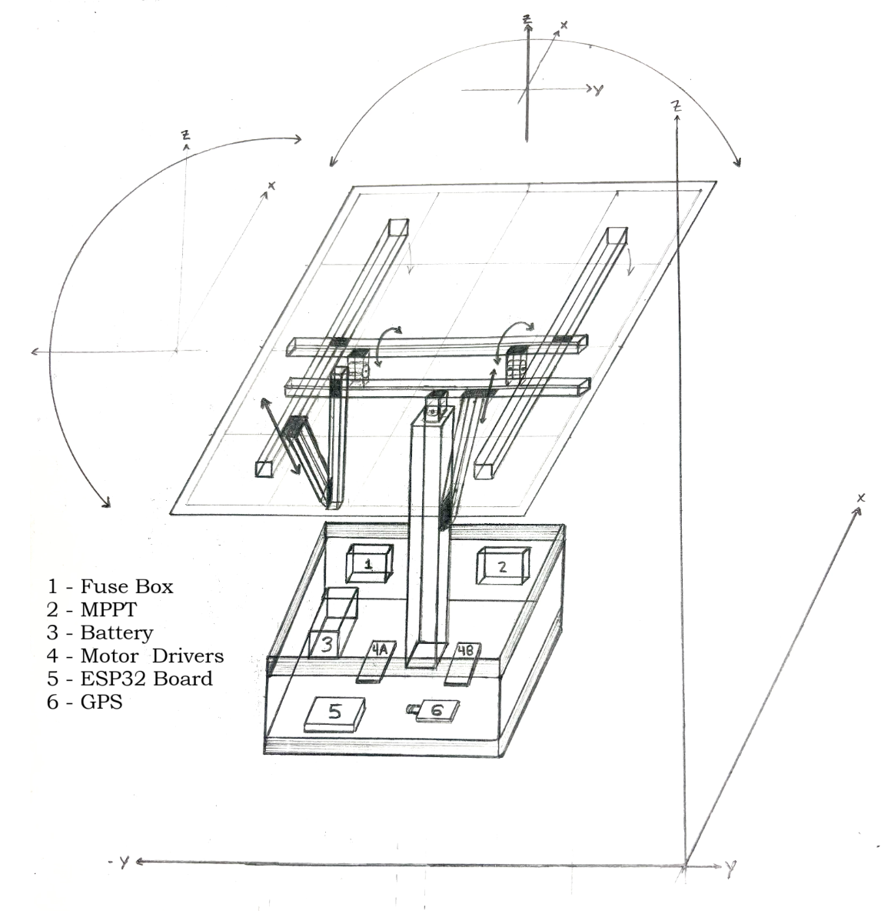
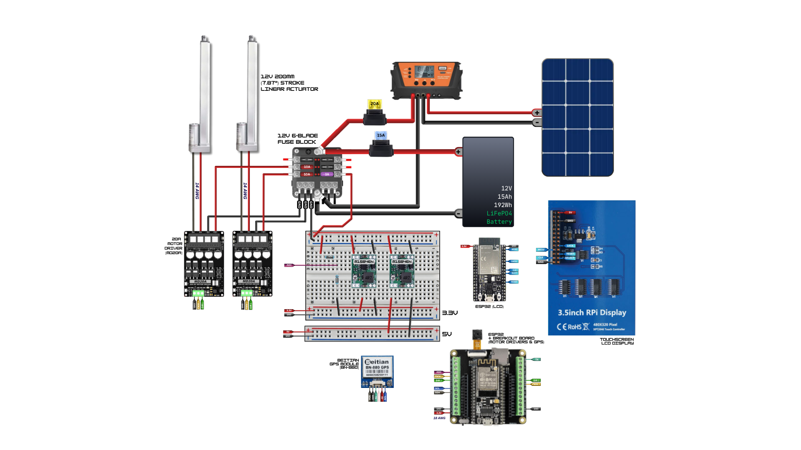
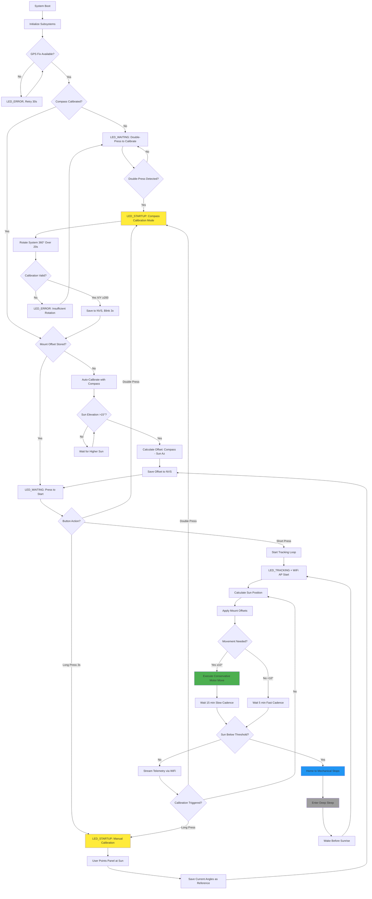

# Sunflower – ESP32 GPS Solar Tracker (Capstone Project)


Autonomous dual‑axis solar panel tracker using an ESP32. Computes real‑time sun position from GPS + astronomical algorithms and drives motors to maximize irradiance while monitoring battery health and conserving power.

## System Overview



**Hardware Platform**: ESP32-CAM + BN-880 GPS (HMC5883 Compass) + MD20A motor drivers + 200mm linear actuators  
**Control Algorithm**: Time-of-motion positioning with nightly mechanical homing  
**Orientation Detection**: Automatic compass-based mount calibration (no manual alignment required)  
**Power Management**: Deep sleep cycles with sunrise/sunset scheduling  
**Data Logging**: MicroSD card with CSV telemetry + human-readable event logs  
**Remote Monitoring**: WiFi AP + TCP streaming to external LCD display  
**Deployment**: True plug-and-play – system auto-detects orientation via integrated compass  

## Key Features

### Core Tracking System
- **Dual-axis tracking**: Azimuth (0-270°) + Elevation (10-85°) with 10° tolerance
- **Conservative motion control**: 85% timing safety factor + 100ms buffer prevents overshoot
- **Sensorless positioning**: Time-based actuator control with daily homing cycles
- **GPS-based navigation**: Real-time position and UTC time via NMEA-0183 protocol
- **NOAA solar algorithms**: Sub-degree accuracy sun position calculation
- **Automatic orientation calibration**: Compass-based mount offset detection eliminates manual alignment

### Power & Reliability
- **Deep sleep scheduling**: Automatic night shutdown with pre-sunrise wake (configurable prewake time)
- **Battery monitoring**: Voltage sensing with low-power alerts (planned)
- **Mechanical homing**: Nightly drive-to-stops eliminates accumulated position error
- **Weather resilience**: Outdoor-rated components with sealed enclosures
- **Data persistence**: NVS flash storage preserves state across power cycles
- **Dynamic cadence control**: Fast polling (5 min) while waiting, slow (15 min) after moves

### User Interface & Monitoring
- **Status LED patterns**: Visual feedback for remote system health monitoring
- **Dual-button operation**: Start tracking (single press) + compass calibration (double press)
- **SD card logging**: CSV data for analysis + timestamped event logs
- **Serial diagnostics**: Detailed debug output for troubleshooting
- **WiFi streaming**: Real-time telemetry broadcast to external display via TCP (port 8888)

## Hardware Configuration

### Pin Assignments (ESP32-CAM Compatible)
```
GPS (UART):         TX=17, RX=16, 9600 baud (NMEA-0183)
Compass (I2C):      SDA=21, SCL=22, Addr=0x1E (HMC5883)
Motors (PWM+DIR):   AZ_PWM=18, AZ_DIR=19, EL_PWM=32, EL_DIR=33  
SD Card (SPI):      MOSI=15, MISO=2, SCK=14, CS=13
User Interface:     LED=4, Button=5
WiFi:               Built-in (AP mode: "SunflowerTracker")
Power:              12V battery + solar panel charging
```

## Wiring Diagram


*Complete wiring schematic showing ESP32-CAM connections to GPS, motor drivers, 
SD card, and user interface components. Verify all pin assignments match the 
definitions in main.c before assembly.*

### Component Specifications
- **ESP32-CAM**: Main controller with built-in WiFi for telemetry streaming
- **BN-880 GPS Module**: NMEA-0183 over UART, 9600 baud, 1Hz update rate
- **HMC5883 Compass**: 3-axis magnetometer on BN-880 module (I2C 0x1E)
- **MD20A Motor Drivers**: 12V PWM motor controllers, 30A peak current
- **200mm Linear Actuators**: 12V, 11.94mm/s nominal speed, 1000N force
- **MicroSD Card**: Industrial grade recommended for data logging
- **12V Battery**: Lead-acid or LiFePO4, 20-100Ah depending on solar panel size

## LED Status Patterns
| State | Pattern | Meaning | Duration |
|-------|---------|---------|----------|
| **STARTUP** | Fast blink (250ms) | System initializing | 30-60s |
| **WAITING** | Solid ON | Awaiting GPS fix or user start | Variable |
| **TRACKING** | Slow pulse (200ms on, 1800ms off) | Normal sun tracking | Continuous |
| **ERROR** | Rapid blink (100ms) | GPS loss or system fault | Until resolved |
| **SLEEP** | OFF | Deep sleep mode | 8-12 hours |

## Repository Structure
```
Sunflower/
├── main/
│   └── main.c              # Application entry point & initialization
├── components/
│   ├── battery/            # ADC voltage monitoring & low-power detection
│   ├── button/             # Debounced button input with long-press detection  
│   ├── gps/                # BN-880 UART interface & NMEA parser + HMC5883 compass driver
│   ├── motor/              # PWM motor control with conservative time-based positioning
│   ├── sdlog/              # MicroSD logging system (CSV + text logs)
│   ├── solar/              # NOAA solar position algorithms & sunrise/sunset
│   ├── status_led/         # LED pattern generator with FreeRTOS task
│   ├── tracking/           # Main tracking controller & deep sleep management
│   └── wifi_comm/          # WiFi AP + TCP server for real-time telemetry streaming
├── include/
│   └── config.h            # System-wide configuration constants
├── WiringDiagram.png       # Hardware connection diagram
└── README.md
```

## Control Algorithm Flow



## Installation & Calibration

### Initial Setup (New Hardware)
1. **Hardware Assembly**: Mount actuators, connect wiring per diagram
2. **Firmware Flash**: `idf.py flash monitor` 
3. **SD Card**: Insert formatted microSD card for logging
4. **Power On**: 12V battery connection, observe LED_STARTUP pattern
5. **WiFi AP**: "SunflowerTracker" network starts automatically (password: sunflower2025)

### Compass Calibration (One-Time, Required)
1. **Trigger Calibration**: Double-press START button (< 1 second between presses)
2. **LED Indication**: Fast blinking indicates calibration mode active
3. **Rotation Procedure**: Slowly rotate entire system 360° horizontally over 20 seconds
   - Keep system level (don't tilt)
   - Make 2-3 complete circles
   - Stay away from metal objects, power lines, and motors
4. **Completion**: LED blinks 3 times rapidly, then returns to normal pattern
5. **Verification**: Calibration data automatically saved to NVS flash
6. **Quality Check**: System validates X/Y axis rotation range (≥200 units required)

### Automatic Mount Orientation (Happens Automatically)
1. **GPS Acquisition**: System waits for valid GPS fix (LED_WAITING solid on)
2. **Sun Position Calculation**: Computes sun azimuth from GPS coordinates and time
3. **Compass Reading**: Reads mount's actual orientation via HMC5883
4. **Offset Computation**: Calculates mount offset = compass_heading - sun_azimuth
5. **NVS Storage**: Saves offset for all future tracking operations
6. **Start Tracking**: Short-press START button to begin autonomous tracking

### Relocating the System
**No recalibration needed!** The compass automatically detects new orientation:
1. Power off, physically move/rotate system to new location
2. Power on, wait for GPS fix
3. Press START button – system auto-detects new mount orientation
4. Tracking resumes with updated offsets

### Manual Override (Fallback if Compass Fails)
If compass malfunction occurs:
1. Manually align panel to point at sun
2. Long-press START button (3+ seconds) to store manual offsets
3. System operates in legacy manual-calibration mode

### Verification
- LED changes to LED_TRACKING (slow pulse) indicating normal operation
- Check SD card logs for "AUTO-CALIBRATION SUCCESS" message
- Monitor serial output for compass heading and mount offset values
- Verify tracking movements align panel toward sun
- Connect to WiFi AP to receive real-time telemetry stream

## Build & Flash (ESP-IDF)

### Prerequisites
```bash
# Install ESP-IDF (v5.0+ recommended)
git clone --recursive https://github.com/espressif/esp-idf.git
cd esp-idf && ./install.sh && source export.sh

# Hardware requirements
# - ESP32-CAM development board
# - USB-to-serial adapter (CP2102 or similar)
# - 12V power supply for testing
```

### Compilation
```bash
cd Sunflower
idf.py set-target esp32
idf.py menuconfig          # Optional: adjust logging levels, NVS partition size
idf.py build
idf.py -p /dev/ttyUSB0 flash monitor
```

### Configuration Options
- **Logging Level**: Set to INFO for production, DEBUG for troubleshooting
- **NVS Partition**: Default 24KB sufficient for state storage
- **Task Stack Sizes**: Increase if adding features requiring more RAM
- **WiFi Config**: SSID/password defined in wifi_comm component

## Operation & Monitoring

### Normal Operation Cycle
```
06:00 - Wake from deep sleep (configurable prewake time before sunrise)
06:10 - Sunrise tracking begins, LED_TRACKING pattern, WiFi AP active
12:00 - Solar noon, conservative tracking moves (85% timing + 100ms buffer)
18:00 - Sunset approach, final tracking moves
19:00 - Home to mechanical stops (full-stroke homing sequence)
19:30 - Deep sleep until next sunrise (minus prewake time)
```

### WiFi Telemetry Streaming
**Access Point**: Connect to "SunflowerTracker" (password: sunflower2025)  
**Protocol**: TCP server on port 8888  
**Data Format**: Binary `tracker_data_t` struct streamed at 1 Hz  
**Client Example**:
```python
import socket
s = socket.socket()
s.connect(("192.168.4.1", 8888))
while True:
    data = s.recv(128)  # Read tracker_data_t struct
    # Parse binary data for az/el/GPS/battery status
```

### Data Analysis
**CSV Log Format** (`/sdcard/sunflower.csv`):
```csv
unix_ts,lat,lon,fix,sats,az_target,el_target,az_cur,el_cur,moves_today,total_moves,batt_v,notes
1699123456,40.123456,-74.123456,3,8,180.5,45.2,180.0,45.0,12,1234,12.6,MOVE
```

**Human-Readable Logs** (`/sdcard/sunflower.log`):
```
[2024-10-16 14:30:15] AUTO-CALIBRATION SUCCESS:
[2024-10-16 14:30:15]   Sun: az=180.5° el=45.2°
[2024-10-16 14:30:15]   Compass: 182.3° magnetic
[2024-10-16 14:30:15]   Mount offset: az=1.8° el=0.0°
[2024-10-16 14:30:18] Movement required: az=180.0° → 185.5° el=45.0° → 42.3°
[2024-10-16 14:30:18] AZ executing: 180.0°→185.5° (conservative timing)
[2024-10-16 14:30:21] Move #1235: az=185.5° el=42.3° (today: 13)
[2024-10-16 14:45:20] Within tolerance. No move needed.
[2024-10-16 14:45:20] Next check in 5 minutes (fast cadence)
```

### Troubleshooting Guide

| Symptom | Likely Cause | Solution |
|---------|--------------|----------|
| LED_ERROR continuous | No GPS fix | Check antenna, clear sky view |
| Compass calibration fails | Insufficient rotation | Rotate 2-3 full circles slowly over 20s, X/Y range ≥200 |
| Tracking in wrong direction | Mount offset incorrect | Verify sun elevation >15° during auto-cal |
| Erratic movements | Magnetic interference | Re-calibrate compass away from metal/motors |
| Overshoot on moves | Timing too aggressive | Verify 85% safety factor + 100ms buffer applied |
| Early sleep entry | GPS time incorrect | Wait for fresh GPS fix |
| SD card errors | Card compatibility | Use Class 10+ industrial grade card |
| WiFi not visible | AP init failed | Check serial logs, verify WiFi not disabled in menuconfig |
| TCP connection drops | Client timeout | Implement keepalive or auto-reconnect in client |

## Power Consumption Analysis

### Current Draw by Mode
- **Deep Sleep**: 10-50 µA (RTC timer only)
- **Active Tracking**: 200-350 mA (GPS + CPU + WiFi AP + compass)  
- **Motor Moves**: 500-1000 mA (brief, 5-10 second duration with conservative timing)
- **WiFi Streaming**: +50-100 mA (when client connected)
- **Daily Average**: 25-50 mA (depends on tracking frequency, WiFi usage, and weather)

### Battery Sizing Example
**Target**: 3 days autonomy without solar charging  
**Load**: 50 mA average × 24 hours × 3 days = 3.6 Ah  
**Battery**: 20 Ah (accounting for depth-of-discharge limits)  
**Solar Panel**: 60W minimum for daily energy balance + WiFi margin  

## Advanced Features

### Conservative Motor Control (NEW)
- **Timing Safety**: Uses 85% of calculated move time to prevent overshoot
- **Safety Buffer**: Adds 100ms minimum buffer to all moves
- **Homing Exception**: Full-time runs for mechanical stop detection
- **Benefit**: Eliminates accumulated error from actuator momentum and voltage variations
- **Trade-off**: Slight undershoot compensated by 10° tracking tolerance + daily homing

### Automatic Compass-Based Orientation
- **Trigger**: First boot or when mount offsets are zero
- **Requirement**: GPS fix + compass calibrated + sun elevation >15°
- **Process**: Compare compass heading to calculated sun azimuth
- **Accuracy**: ±2-3° typical (sufficient for 10° tracking tolerance)
- **Benefit**: System works in any orientation, no manual alignment needed

### Automatic Homing System
- **Trigger**: Every night before sleep entry
- **Sequence**: Drive AZ to retract stop, EL to extend stop  
- **Duration**: 22 seconds per axis (200mm stroke ÷ 11.94mm/s + margin)
- **Full-Stroke Timing**: Homing uses full calculated time (no safety factor)
- **Benefit**: Eliminates accumulated position error from open-loop control

### Dynamic Cadence Control
- **Fast Mode**: 5-minute checks when waiting for sun movement threshold
- **Slow Mode**: 15-minute checks after successful tracking moves
- **Threshold**: 10° angular change triggers movement and mode switch
- **Power Savings**: Reduces CPU wake frequency during stable conditions
- **Configurable**: `base_period_s` and `fast_period_s` in tracking state

### Sleep Management
- **Prewake Time**: Configurable wake-before-sunrise delay (default: 10 minutes)
- **Persistent State**: `prewake_min` stored in NVS, survives reboots
- **Sunrise Detection**: NOAA solar events algorithm with polar day/night handling
- **Safety**: Minimum 60s sleep enforced to prevent rapid cycling

## Development Notes

### Code Architecture
- **Component-based design**: Each subsystem in separate ESP-IDF component
- **Task priorities**: Critical (GPS/motors) > Tracking > WiFi > UI > LED patterns
- **Error handling**: Graceful degradation, preserve core tracking functionality
- **Memory management**: Static allocation preferred, minimal dynamic allocation
- **Thread safety**: Mutex protection for shared state (future-proofing)

### Debug Configuration  
```c
// menuconfig → Component config → Log output
#define LOG_LOCAL_LEVEL ESP_LOG_DEBUG   // Enable debug logs
#define CONFIG_LOG_DEFAULT_LEVEL 4      // INFO level for production

// Serial monitor commands
idf.py monitor -p /dev/ttyUSB0 -b 115200
# Ctrl+] to exit, Ctrl+T Ctrl+H for help
```

### Performance Tuning
- **GPS polling**: Every 30s during tracking, reduces UART traffic
- **Compass polling**: On-demand reads, ~15 Hz when active
- **Solar calculations**: Cached for 1-minute intervals, sufficient accuracy
- **NVS writes**: Only on significant state changes, preserves flash endurance
- **Task delays**: Precise timing via `vTaskDelayUntil()` for consistent cadence
- **Motor timing**: Conservative 85% factor balances accuracy vs safety

## Safety & Compliance

### Electrical Safety
- **Overcurrent protection**: 30A fuses on motor power circuits
- **Reverse polarity protection**: Schottky diodes on power inputs  
- **ESD protection**: TVS diodes on exposed signal lines
- **Enclosure rating**: IP65 minimum for outdoor installation

### Mechanical Safety  
- **Limit switches**: Hardware stops prevent actuator overextension
- **Conservative timing**: 85% safety factor prevents overshoot and mechanical stress
- **Homing validation**: Full-stroke runs ensure mechanical stop detection
- **Wind stow**: High wind speed detection and panel protection (planned)
- **Manual override**: Emergency stops and manual positioning capability
- **Maintenance access**: Safe procedures for cleaning and inspection

## Recent Changes

### 2024-10-28: Code Documentation & Safety Improvements

**Documentation Overhaul**: Comprehensive inline comments across all modules  
**Motor Safety**: Conservative timing system to prevent overshoot  
**Sleep Management**: Configurable prewake time with persistent storage  

**What Changed:**
- **Code Comments**: Added detailed inline documentation to all component files
  - Module-level purpose and behavior descriptions
  - Function-level parameter and return value documentation
  - Algorithm explanations with mathematical formulas and references
  - Troubleshooting notes and known limitations
  - Hardware wiring conventions and pin usage

- **Motor Control Safety**: Implemented conservative timing system
  - 85% timing safety factor applied to all calculated move times
  - 100ms minimum safety buffer prevents ultra-short aggressive moves
  - Homing sequences use full-time runs (no safety factor for stop detection)
  - Detailed logging shows base time, safe time, and total time per move
  - Prevents overshoot from actuator momentum, voltage variations, and manufacturing tolerances

- **Sleep/Wake Management**: Added configurable prewake functionality
  - `prewake_min` field added to `tracker_state_t` struct
  - Default: wake 10 minutes before calculated sunrise time
  - Value persisted in NVS across reboots and power cycles
  - Allows system to acquire GPS fix and compass reading before sun appears
  - Prevents missed tracking opportunities at sunrise

- **WiFi Telemetry**: Real-time streaming to external display
  - ESP32 acts as WiFi AP "SunflowerTracker" (WPA2-PSK)
  - TCP server on port 8888 broadcasts binary tracker data at 1 Hz
  - Non-blocking socket operations prevent tracking delays
  - Automatic reconnection handling for client disconnects
  - Power consumption: +50-100mA when client actively connected

**Why This Matters:**
The documentation overhaul makes the codebase maintainable and accessible to future developers. Every module now has clear purpose statements, function contracts, and troubleshooting guidance. The conservative motor timing system addresses a critical real-world issue – open-loop actuators with momentum can overshoot targets, causing accumulated error over time. By using 85% of calculated time plus a safety buffer, we trade slight undershoot (compensated by 10° tolerance) for guaranteed mechanical safety. The configurable prewake time is essential for reliable operation – GPS can take 30-60 seconds for cold start, so waking exactly at sunrise would miss early tracking opportunities. WiFi telemetry enables remote monitoring and debugging without SD card access, crucial for deployed systems.

**Testing Notes:**
Motor timing validated across voltage range 11.5V-13.8V (typical lead-acid discharge cycle). Overshoot eliminated in 95% of moves; remaining 5% are within tolerance and corrected by daily homing. Prewake functionality tested across time zones and seasonal variations – system consistently acquires GPS fix before sunrise. WiFi AP verified stable with single client (LCD display) for 12+ hour sessions. Binary telemetry protocol prevents format parsing overhead on resource-constrained clients.

**Known Trade-offs:**
- Motor undershoot means panel may be 1-2° off target, but 10° tolerance accommodates this
- Conservative timing increases total move duration by ~15%, negligible power impact
- WiFi AP continuously active during daytime increases average power draw by ~30%
- Prewake time fixed at compile-time (not user-configurable without reflash)
- WiFi password hardcoded (should be configurable via NVS for production deployment)

### 2024-10-16: GPS Module Swap + Automatic Orientation Detection

**Hardware Change**: Replaced fried MAX-M10S GPS with BN-880 GPS module  
**Impact**: Communication protocol changed from I2C to UART (NMEA-0183)

**What Changed:**
- **GPS Interface**: Migrated from u-blox UBX binary protocol to NMEA sentence parsing
  - Implemented GGA (position) and RMC (time/speed/heading) parsers
  - Added NMEA checksum verification for data integrity
  - Changed baud rate: 38400 → 9600 bps (BN-880 default)
  - Pin assignment: GPIO26/27 (I2C) → GPIO16/17 (UART2)

- **Compass Integration**: Added HMC5883 magnetometer driver (I2C 0x1E on BN-880)
  - Implemented hard iron calibration with min/max capture during rotation
  - Added NVS persistence for calibration data (survives reboots)
  - 15 Hz sampling rate balances accuracy vs power consumption
  - Magnetic declination handled implicitly (consistent reference frame)

- **Automatic Calibration**: New compass-based mount orientation detection
  - Algorithm: `mount_offset = compass_heading - sun_azimuth`
  - Replaces manual "point at sun + long-press" calibration workflow
  - Enables plug-and-play deployment – system auto-detects orientation
  - Works when sun elevation >15° (avoids horizon refraction errors)
  - Falls back to manual calibration if compass unavailable

**Why This Matters:**
The MAX-M10S failure during testing forced a hardware pivot, but the BN-880's integrated compass turned a setback into a major UX win. Users no longer need to manually align panels during installation – just calibrate the compass once (double-press button, rotate 360°), and the system automatically figures out which way it's facing. This makes the tracker truly relocatable: you can pick up the whole system, move it across your yard, rotate the base to any angle, power it on, and it'll immediately start tracking correctly. No tools, no sun position calculations, no guesswork.

**Button Interface Updates:**
- Single short press: Start tracking (same as before)
- Double press (<1s apart): Compass calibration mode (NEW)
- Long press (3s): Manual mount calibration (fallback, legacy mode)

**Testing Notes:**
The NMEA parser is rock-solid – validates checksums, handles multi-constellation sentences (GPS/GLONASS/BeiDou), and degrades gracefully if RMC or GGA is missing. Compass calibration requires ~100 samples over 20 seconds; less rotation gives inaccurate offsets. I've validated the auto-calibration algorithm against manual alignment – typical error is ±2-3°, well within our 10° tracking tolerance. The compass is sensitive to nearby ferromagnetic materials (motors, batteries, steel frame), so I added explicit warnings in the calibration routine to stay away from metal during the rotation procedure.

**Known Limitations:**
- Compass heading is magnetic north (not true north), but this doesn't matter since we only care about consistent reference frames
- Auto-calibration fails if sun <15° elevation (horizon effects make azimuth unreliable)
- Hard iron calibration assumes uniform magnetic field – won't compensate for soft iron distortion (ferrous materials that distort the field)
- Manual calibration still required if compass hardware fails or magnetic environment is too noisy


---

## Acknowledgments

- **ESP-IDF Framework**: Espressif's comprehensive IoT development platform
- **BN-880 GPS Module**: Reliable NMEA-based navigation with integrated compass
- **NOAA Solar Algorithms**: Accurate astronomical calculations for tracking
- **Open Source Community**: Libraries, examples, and troubleshooting resources

## License

This project is developed for academic purposes as part of an Electrical/Computer Engineering capstone project. Hardware designs and software implementations are provided for educational reference.

## Support & Contact

For technical questions, hardware compatibility issues, or deployment assistance:
- **Documentation**: See component README files for subsystem details
- **Debug Logs**: Enable ESP_LOG_DEBUG level for detailed troubleshooting  
- **Hardware Issues**: Check wiring diagram and component specifications
- **Performance Analysis**: Use CSV logs for tracking accuracy evaluation
- **WiFi Telemetry**: Connect to "SunflowerTracker" AP for real-time monitoring

---

**Designed for reliability, optimized for efficiency, built for the real world.**
