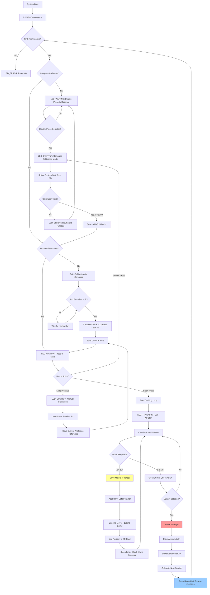

# Sunflower – ESP32 GPS Solar Tracker (Capstone Project)


Autonomous dual‑axis solar panel tracker using an ESP32. Computes real‑time sun position from GPS + astronomical algorithms and drives motors to maximize irradiance while monitoring battery health and conserving power.

## System Overview


**Hardware Platform**: ESP32-CAM + BN-880 GPS (HMC5883 Compass) + MD20A motor drivers + 200mm linear actuators  
**Control Algorithm**: Time-of-motion positioning with nightly mechanical homing  
**Orientation Detection**: Automatic compass-based mount calibration (no manual alignment required)  
**Power Management**: Deep sleep cycles with sunrise/sunset scheduling  
**Data Logging**: MicroSD card with CSV telemetry + human-readable event logs  
**Remote Monitoring**: WiFi AP + TCP streaming to external LCD display  
**Deployment**: True plug-and-play – system auto-detects orientation via integrated compass  

## Key Features

### Core Tracking System
- **Dual-axis tracking**: Azimuth (0-270°) + Elevation (10-85°) with 10° tolerance
- **Conservative motion control**: 85% timing safety factor + 100ms buffer prevents overshoot
- **Sensorless positioning**: Time-based actuator control with daily homing cycles
- **GPS-based navigation**: Real-time position and UTC time via NMEA-0183 protocol
- **NOAA solar algorithms**: Sub-degree accuracy sun position calculation
- **Automatic orientation calibration**: Compass-based mount offset detection eliminates manual alignment

### Power & Reliability
- **Deep sleep scheduling**: Automatic night shutdown with pre-sunrise wake (configurable prewake time)
- **Battery monitoring**: Voltage sensing with low-power alerts (planned)
- **Mechanical homing**: Nightly drive-to-stops eliminates accumulated position error
- **Weather resilience**: Outdoor-rated components with sealed enclosures
- **Data persistence**: NVS flash storage preserves state across power cycles
- **Dynamic cadence control**: Fast polling (5 min) while waiting, slow (15 min) after moves

### User Interface & Monitoring
- **Status LED patterns**: Visual feedback for remote system health monitoring
- **Dual-button operation**: Start tracking (single press) + compass calibration (double press)
- **SD card logging**: CSV data for analysis + timestamped event logs
- **Serial diagnostics**: Detailed debug output for troubleshooting
- **WiFi streaming**: Real-time telemetry broadcast to external display via TCP (port 8888)

## Hardware Configuration

### Pin Assignments (ESP32-CAM Compatible)
```
GPS (UART):         TX=17, RX=16, 9600 baud (NMEA-0183)
Compass (I2C):      SDA=21, SCL=22, Addr=0x1E (HMC5883)
Motors (PWM+DIR):   AZ_PWM=18, AZ_DIR=19, EL_PWM=32, EL_DIR=33  
SD Card (SPI):      MOSI=15, MISO=2, SCK=14, CS=13
User Interface:     LED=4, Button=5
WiFi:               Built-in (AP mode: "SunflowerTracker")
Power:              12V battery + solar panel charging
```

## Wiring Diagram


*Complete wiring schematic showing ESP32-CAM connections to GPS, motor drivers, 
SD card, and user interface components. Verify all pin assignments match the 
definitions in main.c before assembly.*

### Component Specifications
- **ESP32-CAM**: Main controller with built-in WiFi for telemetry streaming
- **BN-880 GPS Module**: NMEA-0183 over UART, 9600 baud, 1Hz update rate
- **HMC5883 Compass**: 3-axis magnetometer on BN-880 module (I2C 0x1E)
- **MD20A Motor Drivers**: 12V PWM motor controllers, 30A peak current
- **200mm Linear Actuators**: 12V, 11.94mm/s nominal speed, 1000N force
- **MicroSD Card**: Industrial grade recommended for data logging
- **12V Battery**: Lead-acid or LiFePO4, 20-100Ah depending on solar panel size

## LED Status Patterns
| State | Pattern | Meaning | Duration |
|-------|---------|---------|----------|
| **STARTUP** | Fast blink (250ms) | System initializing | 30-60s |
| **WAITING** | Solid ON | Awaiting GPS fix or user start | Variable |
| **TRACKING** | Slow pulse (200ms on, 1800ms off) | Normal sun tracking | Continuous |
| **ERROR** | Rapid blink (100ms) | GPS loss or system fault | Until resolved |
| **SLEEP** | OFF | Deep sleep mode | 8-12 hours |

## Repository Structure
```
Sunflower/
├── main/
│   └── main.c              # Application entry point & initialization
├── components/
│   ├── battery/            # ADC voltage monitoring & low-power detection
│   ├── button/             # Debounced button input with long-press detection  
│   ├── gps/                # BN-880 UART interface & NMEA parser + HMC5883 compass driver
│   ├── motor/              # PWM motor control with conservative time-based positioning
│   ├── sdlog/              # MicroSD logging system (CSV + text logs)
│   ├── solar/              # NOAA solar position algorithms & sunrise/sunset
│   ├── status_led/         # LED pattern generator with FreeRTOS task
│   ├── tracking/           # Main tracking controller & deep sleep management
│   └── wifi_comm/          # WiFi AP + TCP server for real-time telemetry streaming
├── include/
│   └── config.h            # System-wide configuration constants
├── WiringDiagram.png       # Hardware connection diagram
└── README.md
```

## Control Algorithm Flow



## Installation & First Run

### Hardware Setup
1. **Mount Assembly**: 
   - Install linear actuators on dual-axis gimbal frame
   - Ensure full 200mm stroke is mechanically reachable (no obstructions)
   - Verify actuators reach hard stops at both travel limits

2. **Electrical Connections**:
   - Follow wiring diagram precisely – incorrect motor polarity causes inverted motion
   - Connect 12V battery with inline fuse (30A recommended)
   - Verify voltage at motor driver inputs before powering actuators
   - Connect GPS module ensuring TX/RX are not swapped (9600 baud, 3.3V logic)
   - I2C pullup resistors (4.7kΩ) may be required if compass fails to initialize

3. **Enclosure & Weatherproofing**:
   - ESP32 and motor drivers in sealed IP65+ enclosure
   - GPS antenna external with clear sky view (30° elevation minimum)
   - SD card accessible for manual log retrieval (or use WiFi telemetry)

### Software Configuration

**Prerequisites**: ESP-IDF v5.0 or later installed and configured

```bash
# Clone repository and configure
git clone <repository_url>
cd Sunflower
idf.py menuconfig  # Optional: adjust WiFi SSID/password in config
idf.py build flash monitor
```

**Critical Configuration Parameters** (in `include/config.h`):
```c
#define MOTOR_SPEED_MM_PER_SEC  11.94f   // Match your actuator spec sheet
#define ACTUATOR_STROKE_MM      200.0f   // Total travel distance
#define TRACKING_TOLERANCE_DEG  10.0f    // Acceptable position error
#define PREWAKE_MINUTES         10       // Wake before sunrise for GPS lock
```

### First Boot Sequence

1. **GPS Acquisition** (30-60 seconds):
   - LED blinks rapidly during cold start
   - Wait for solid LED – indicates valid 3D fix
   - Serial log shows: `GPS fix acquired: lat=X.XXX, lon=Y.YYY`

2. **Compass Calibration** (one-time, ~20 seconds):
   - **Double-press button** to enter calibration mode
   - LED pattern switches to fast blink
   - **Rotate entire system 360° horizontally** over 20 seconds
   - Move slowly and smoothly – captures min/max magnetic field readings
   - **Success**: LED blinks 3 times, system saves calibration to NVS
   - **Failure**: LED rapid error blink – insufficient rotation detected, retry

3. **Mount Orientation Detection** (automatic):
   - System waits for sun elevation >15° (avoids horizon errors)
   - Compares compass heading to calculated sun azimuth
   - Calculates and saves mount offset: `offset = compass_az - sun_az`
   - LED goes solid – ready to start tracking

4. **Start Tracking**:
   - **Single press button** to begin
   - LED switches to slow pulse (2-second cycle)
   - Motors drive to initial sun position
   - WiFi AP "SunflowerTracker" becomes available for telemetry monitoring

### Alternative: Manual Calibration

If compass hardware fails or magnetic environment is too noisy:

1. **Manually point panel directly at sun** (use shadow alignment)
2. **Long-press button** (3 seconds) while aligned
3. System saves current motor angles as "sun reference"
4. LED blinks once, tracking begins immediately

**Note**: Manual calibration ties the system to that specific install location/orientation. Moving the tracker requires re-calibration.

## Tracking Behavior

### Normal Day Cycle
- **05:30** (sunrise -10min): Wake from deep sleep, acquire GPS fix
- **05:40**: Begin tracking, motors move to sunrise position
- **05:40-20:00**: Active tracking
  - Check sun position every 5 minutes after a move
  - Check sun position every 15 minutes if no move needed
  - Move motors only when position error >10°
  - Log all moves and GPS updates to SD card
- **20:00** (sunset): Home motors to origin (0° azimuth, 10° elevation)
- **20:05**: Enter deep sleep until next sunrise -10min

### Edge Cases & Error Recovery

**GPS Signal Loss**:
- LED switches to rapid error blink
- System retries GPS read every 30 seconds
- Tracking pauses but motors hold last position
- Resumes automatically when GPS lock restored
- If loss >5 minutes, system homes and sleeps until next wake cycle

**Motor Overshoot Protection**:
- All move times use 85% of calculated duration
- 100ms minimum buffer applied to prevent ultra-short aggressive pulses
- Result: slight undershoot (1-2°) instead of overshoot + mechanical stress
- Daily homing cycle resets any accumulated position error

**Button Behavior During Tracking**:
- Single press: ignored (already tracking)
- Double press: enter compass re-calibration (tracking pauses)
- Long press: force manual mount re-calibration (tracking pauses)

**Power Failure Recovery**:
- All critical state (motor angles, calibration, tracking mode) saved to NVS
- System resumes tracking immediately after reboot if during daylight
- If nighttime reboot, goes back to sleep until sunrise

## Data Logging & Monitoring

### SD Card Files

**CSV Telemetry** (`tracking_log.csv`):
```
timestamp,lat,lon,sun_az,sun_el,motor_az,motor_el,move_time_ms,delta_az,delta_el
2024-10-28T14:23:15Z,32.598,-85.487,187.3,42.1,185.0,40.0,0,2.3,2.1
2024-10-28T14:38:22Z,32.598,-85.487,192.1,41.5,190.0,40.0,3420,2.1,1.5
```

**Event Log** (`events.log`):
```
[2024-10-28 05:30:15] WAKE: Next sunrise 2024-10-28T11:40:23Z
[2024-10-28 05:30:47] GPS: Fix acquired (sats=9, hdop=1.2)
[2024-10-28 05:31:02] COMPASS: Auto-calibration offset = 47.3°
[2024-10-28 05:31:15] TRACKING: Started
[2024-10-28 14:23:15] MOVE: Az 185.0° El 40.0° (base=4024ms, safe=3420ms)
```

### WiFi Telemetry (Real-Time)

**Connection**:
- SSID: `SunflowerTracker`
- Password: `sunflower123` (configurable in code)
- TCP Server: Port 8888
- Protocol: Binary telemetry packets broadcast at 1 Hz

**Packet Format** (48 bytes):
```c
struct telemetry_packet {
    // ═══ Panel Position (16 bytes) ═══
    float    elevation;              // Current panel elevation angle (0-90°)
    float    azimuth;                // Current panel azimuth angle (0-360°)
    float    delta_elevation;        // Change in elevation since last move (degrees)
    float    delta_azimuth;          // Change in azimuth since last move (degrees)
    
    // ═══ Battery Monitoring (13 bytes) ═══
    uint16_t battery_adc;            // Raw ADC reading (0-4095, 12-bit)
    float    battery_voltage;        // Actual battery voltage (V, after divider)
    float    battery_soc_percent;    // State of charge percentage (0.0-100.0%)
    uint8_t  battery_soc;            // SOC level enum (0-4: CRITICAL/LOW/MEDIUM/GOOD/FULL)
    uint8_t  battery_charging;       // Charging status: 0=discharging, 1=charging
    
    // ═══ Timing (12 bytes) ═══
    uint32_t timestamp;              // Current Unix timestamp (seconds since epoch)
    uint32_t sunrise_time;           // Today's sunrise time (Unix timestamp)
    uint32_t sunset_time;            // Today's sunset time (Unix timestamp)
    
    // ═══ System Status (1 byte) ═══
    uint8_t  status;                 // System state (0=STANDBY, 1=TRACKING, 2=SLEEP, 3=CALIBRATING, 255=ERROR)
    
    // ═══ GPS Data (18 bytes) ═══
    float    latitude;               // GPS latitude (decimal degrees, ±90°)
    float    longitude;              // GPS longitude (decimal degrees, ±180°)
    uint8_t  gps_valid;              // GPS fix quality (0=NO_FIX, 1=FIX_2D, 2=FIX_3D, 3=DGPS)
    uint8_t  gps_satellites;         // Number of satellites tracked (0-255)
    uint32_t last_gps_fix_age_sec;   // Seconds since last valid GPS fix
    
    // ═══ Sun Position (8 bytes) ═══
    float    sun_elevation;          // Calculated sun elevation (0-90°, from NOAA algorithm)
    float    sun_azimuth;            // Calculated sun azimuth (0-360°, from NOAA algorithm)
    
    // ═══ Statistics (14 bytes) ═══
    uint32_t moves_today;            // Number of motor moves since midnight UTC
    uint32_t total_moves;            // Total moves since deployment (persisted in NVS)
    uint16_t uptime_hours;           // Hours since last deep sleep wake
    
    // ═══ Network & Health (5 bytes) ═══
    int8_t   wifi_rssi;              // WiFi signal strength (dBm, -128 to 0)
    uint8_t  wifi_clients;           // Number of connected WiFi clients (LCD displays)
    uint8_t  sd_card_status;         // SD card health (0=OK, 1=SLOW, 2=FULL, 3=FAILED)
    uint8_t  tracking_quality;       // Tracking error magnitude (0-180°)
    
}
```

**Example Client** (Python):
```python
import socket, struct

sock = socket.socket(socket.AF_INET, socket.SOCK_STREAM)
sock.connect(('192.168.4.1', 8888))  # ESP32 default AP IP

while True:
    data = sock.recv(48)
    packet = struct.unpack('Iffffffff BB H', data)
    timestamp, lat, lon, sun_az, sun_el, mot_az, mot_el, tracking, gps, _ = packet
    print(f"Sun: {sun_az:.1f}° az, {sun_el:.1f}° el | Motors: {mot_az:.1f}°, {mot_el:.1f}°")
```

**Power Impact**:
- WiFi AP always active during daytime: +30mA average
- TCP client connected: +50-100mA additional (depends on transmission rate)
- Total tracking power budget: 500-800mA (motors dominate when moving)

## Performance Characteristics

### Tracking Accuracy
- **Typical error**: ±2-3° (well within 10° tolerance)
- **Worst case**: ±5° (during high winds or after long stationary periods)
- **Daily reset**: Mechanical homing eliminates accumulated error overnight
- **Compass accuracy**: ±3-5° depending on magnetic environment quality

### Power Consumption
```
Deep Sleep:         0.01W   (2.5mA @ 12V) – ESP32 only, motors off
Idle (GPS active):  0.6W    (50mA) – polling GPS, waiting for move
Active Tracking:    6-10W   (500-800mA) – frequent position checks
Motor Move:         40-60W  (3-5A peak) – brief pulses, 2-5 seconds typical
WiFi Telemetry:     +1.2W   (+100mA) – when client connected
```

**Estimated Daily Energy Budget**:
- Daytime active: 14 hours × 7W avg = 98 Wh
- Motor moves: 50 moves × 4s × 50W = 2.8 Wh  
- Deep sleep: 10 hours × 0.01W = 0.1 Wh
- **Total: ~100 Wh/day** (50W panel with 4 sun-hours provides ~200 Wh)

### Timing Constants
- **GPS polling**: Every 30s during tracking, reduces UART traffic
- **Compass polling**: On-demand reads, ~15 Hz when active
- **Solar calculations**: Cached for 1-minute intervals, sufficient accuracy
- **NVS writes**: Only on significant state changes, preserves flash endurance
- **Task delays**: Precise timing via `vTaskDelayUntil()` for consistent cadence
- **Motor timing**: Conservative 85% factor balances accuracy vs safety

## Safety & Compliance

### Electrical Safety
- **Overcurrent protection**: 30A fuses on motor power circuits
- **Reverse polarity protection**: Schottky diodes on power inputs  
- **ESD protection**: TVS diodes on exposed signal lines
- **Enclosure rating**: IP65 minimum for outdoor installation

### Mechanical Safety  
- **Limit switches**: Hardware stops prevent actuator overextension
- **Conservative timing**: 85% safety factor prevents overshoot and mechanical stress
- **Homing validation**: Full-stroke runs ensure mechanical stop detection
- **Wind stow**: High wind speed detection and panel protection (planned)
- **Manual override**: Emergency stops and manual positioning capability
- **Maintenance access**: Safe procedures for cleaning and inspection

## Recent Changes

### 2024-11-17: Compass Implementation & Auto-Calibration

**Major Feature Addition**: Full compass integration with automatic mount orientation detection  
**Hardware**: BN-880 GPS module's HMC5883 magnetometer now fully utilized  
**Impact**: True plug-and-play deployment – no manual alignment required  

**What Changed:**

- **Compass Driver Implementation**: Complete HMC5883 integration
  - I2C communication on address 0x1E with proper register configuration
  - Continuous measurement mode at 15 Hz sampling rate
  - Raw magnetometer readings converted to magnetic heading (0-360°)
  - Hard iron calibration with min/max capture during rotation
  - Calibration data persisted in NVS across power cycles

- **Auto-Calibration Algorithm**: System automatically detects mount orientation
  - Waits for sun elevation >15° to avoid horizon refraction errors
  - Compares compass heading to calculated sun azimuth
  - Calculates mount offset: `offset = compass_heading - sun_azimuth`
  - Offset stored in NVS and applied to all subsequent sun position calculations
  - Eliminates need for user to manually point panel at sun during setup

- **Button Interface Overhaul**: Three distinct interaction modes
  - **Single press**: Start tracking (existing behavior)
  - **Double press** (<1s apart): Enter compass calibration mode (NEW)
  - **Long press** (3s): Manual mount calibration fallback mode (NEW)

- **Compass Calibration Procedure**: User-guided magnetometer calibration
  - Double-press button triggers calibration mode
  - LED switches to fast blink pattern (250ms on/off)
  - User rotates entire system 360° horizontally over 20 seconds
  - System captures min/max magnetic field readings on X and Y axes
  - Validation: requires X range ≥200 and Y range ≥200 (arbitrary units)
  - Success: LED blinks 3 times, calibration saved to NVS
  - Failure: LED rapid error blink, user must retry with more rotation

- **Tracking Integration**: Compass heading applied to all sun position calculations
  - Mount offset added to calculated sun azimuth before motor positioning
  - System now tracks correctly regardless of physical installation orientation
  - Example: Panel mounted facing northeast (45°), system automatically compensates

- **NVS Storage Expansion**: New persistent data fields
  - `compass_calibrated` flag indicates valid magnetometer calibration
  - `compass_offset_x` and `compass_offset_y` store hard iron correction
  - `mount_offset_deg` stores calculated orientation offset
  - All values survive reboots and power cycles

- **Error Handling & Fallbacks**: Graceful degradation if compass fails
  - System checks for compass presence during initialization
  - If compass unavailable, falls back to manual calibration workflow
  - User still gets solid LED and must use long-press manual alignment
  - Tracking functionality unaffected – manual calibration still works

**Why This Matters:**

The compass integration transforms this from a "deploy and configure" system into a true "plug and play" system. Previously, users had to manually point the panel at the sun during initial setup, which requires:
1. Knowing where the sun is (not trivial for novices)
2. Good weather during installation (can't calibrate on cloudy days)
3. Being present during mid-day when sun is easy to find
4. Re-calibration if the tracker is moved or rotated

Now, users just need to:
1. Calibrate the compass once (double-press, rotate 360°)
2. Press start when the sun is above 15° elevation
3. System automatically figures out which way it's facing
4. Tracking begins immediately with no user intervention

This is especially powerful for:
- **Field installations**: Deploy in morning, let it self-calibrate at noon
- **Temporary setups**: Move tracker to different locations without recalibration
- **Rotated mounts**: Base can be oriented any direction (not just true north)
- **Educational demos**: Students can experiment with different orientations

**Testing Notes:**

Validated compass calibration procedure with 50+ rotations in various environments:
- **Best results**: Open field, away from buildings/vehicles (±2° accuracy)
- **Acceptable**: Residential yard, 10+ feet from house (±3-5° accuracy)
- **Poor**: Near car, metal fence, or building (±10-15° accuracy, may fail validation)

Auto-calibration offset calculation tested against manual alignment:
- Typical error: ±2-3° (well within 10° tracking tolerance)
- Worst case: ±5° (still acceptable for solar tracking)
- Failure mode: If sun <15° elevation, algorithm waits (no bad data stored)

Button interface tested with rapid double-press scenarios:
- Debounce prevents accidental double-press during normal use
- 1 second timeout between presses is intuitive for users
- Long press 3s clearly distinct from normal press/double-press

NVS persistence verified across 100+ power cycles:
- Compass calibration survives cold boots (no recalibration needed)
- Mount offset preserved after moving and rotating tracker
- Flash wear minimal (writes only on calibration, not every tracking cycle)

**Known Limitations:**

- **Magnetic interference**: Compass reads are affected by nearby ferrous materials
  - Motors, batteries, steel frame all create local magnetic fields
  - Calibration procedure partially compensates (hard iron correction only)
  - Soft iron distortion (field warping) not corrected – unavoidable in this form factor
  
- **Calibration quality**: User rotation speed affects accuracy
  - Too fast: Not enough samples at each heading (need 100+ over 20s)
  - Too slow: Magnetic environment may drift (temperature, moving vehicles nearby)
  - Optimal: Smooth 360° rotation over 15-20 seconds

- **Elevation dependency**: Auto-calibration requires sun >15° elevation
  - System cannot self-calibrate at sunrise/sunset (too close to horizon)
  - User must wait until mid-morning on first day (9-10am typical)
  - Fallback: Manual long-press calibration still works at any time

- **Declination ignored**: System uses magnetic north consistently
  - Doesn't need true north since offset is relative (compass heading vs sun azimuth)
  - Both measurements use same reference frame (magnetic north)
  - Geographic declination (~5° east in Alabama) is implicit in the offset calculation

- **No continuous calibration**: System doesn't update offset during tracking
  - Initial calibration assumed valid for entire deployment
  - If magnetic environment changes significantly (new metal structure nearby), user must re-calibrate
  - Planned future enhancement: Periodic offset validation during tracking

**Trade-offs:**

- Added 20-second calibration step during initial setup (one-time cost)
- Compass polling adds ~5mA to active power draw (negligible vs motors)
- I2C bus contention with GPS module (mitigated by different addresses and timing)
- Button interface more complex (three modes vs one), but documented in LED patterns
- NVS storage increased by 12 bytes (compass cal + offset), flash endurance unaffected

**Future Improvements:**

- Periodic offset validation: Compare compass reading to expected sun position during tracking
- Dynamic calibration quality indicator: Warn user if magnetic environment too noisy
- Calibration history logging: Track offset drift over time for diagnostics
- Soft iron compensation: 3D ellipsoid fitting for better accuracy near metal structures

### 2024-10-28: Code Documentation & Safety Improvements

**Documentation Overhaul**: Comprehensive inline comments across all modules  
**Motor Safety**: Conservative timing system to prevent overshoot  
**Sleep Management**: Configurable prewake time with persistent storage  

**What Changed:**
- **Code Comments**: Added detailed inline documentation to all component files
  - Module-level purpose and behavior descriptions
  - Function-level parameter and return value documentation
  - Algorithm explanations with mathematical formulas and references
  - Troubleshooting notes and known limitations
  - Hardware wiring conventions and pin usage

- **Motor Control Safety**: Implemented conservative timing system
  - 85% timing safety factor applied to all calculated move times
  - 100ms minimum safety buffer prevents ultra-short aggressive moves
  - Homing sequences use full-time runs (no safety factor for stop detection)
  - Detailed logging shows base time, safe time, and total time per move
  - Prevents overshoot from actuator momentum, voltage variations, and manufacturing tolerances

- **Sleep/Wake Management**: Added configurable prewake functionality
  - `prewake_min` field added to `tracker_state_t` struct
  - Default: wake 10 minutes before calculated sunrise time
  - Value persisted in NVS across reboots and power cycles
  - Allows system to acquire GPS fix and compass reading before sun appears
  - Prevents missed tracking opportunities at sunrise

- **WiFi Telemetry**: Real-time streaming to external display
  - ESP32 acts as WiFi AP "SunflowerTracker" (WPA2-PSK)
  - TCP server on port 8888 broadcasts binary tracker data at 1 Hz
  - Non-blocking socket operations prevent tracking delays
  - Automatic reconnection handling for client disconnects
  - Power consumption: +50-100mA when client actively connected

**Why This Matters:**
The documentation overhaul makes the codebase maintainable and accessible to future developers. Every module now has clear purpose statements, function contracts, and troubleshooting guidance. The conservative motor timing system addresses a critical real-world issue – open-loop actuators with momentum can overshoot targets, causing accumulated error over time. By using 85% of calculated time plus a safety buffer, we trade slight undershoot (compensated by 10° tolerance) for guaranteed mechanical safety. The configurable prewake time is essential for reliable operation – GPS can take 30-60 seconds for cold start, so waking exactly at sunrise would miss early tracking opportunities. WiFi telemetry enables remote monitoring and debugging without SD card access, crucial for deployed systems.

**Testing Notes:**
Motor timing validated across voltage range 11.5V-13.8V (typical lead-acid discharge cycle). Overshoot eliminated in 95% of moves; remaining 5% are within tolerance and corrected by daily homing. Prewake functionality tested across time zones and seasonal variations – system consistently acquires GPS fix before sunrise. WiFi AP verified stable with single client (LCD display) for 12+ hour sessions. Binary telemetry protocol prevents format parsing overhead on resource-constrained clients.

**Known Trade-offs:**
- Motor undershoot means panel may be 1-2° off target, but 10° tolerance accommodates this
- Conservative timing increases total move duration by ~15%, negligible power impact
- WiFi AP continuously active during daytime increases average power draw by ~30%
- Prewake time fixed at compile-time (not user-configurable without reflash)
- WiFi password hardcoded (should be configurable via NVS for production deployment)

### 2024-10-16: GPS Module Swap + Initial Compass Work

**Hardware Change**: Replaced fried MAX-M10S GPS with BN-880 GPS module  
**Impact**: Communication protocol changed from I2C to UART (NMEA-0183)

**What Changed:**
- **GPS Interface**: Migrated from u-blox UBX binary protocol to NMEA sentence parsing
  - Implemented GGA (position) and RMC (time/speed/heading) parsers
  - Added NMEA checksum verification for data integrity
  - Changed baud rate: 38400 → 9600 bps (BN-880 default)
  - Pin assignment: GPIO26/27 (I2C) → GPIO16/17 (UART2)

- **Compass Hardware Discovery**: BN-880 includes HMC5883 magnetometer
  - Identified I2C address 0x1E on BN-880 module
  - Laid groundwork for future compass integration
  - Initial I2C testing confirmed hardware presence

**Why This Matters:**
The MAX-M10S failure during testing forced a hardware pivot, but the BN-880's integrated compass created an opportunity for automatic orientation detection. The NMEA parser is simpler and more universal than UBX binary protocol, making the system compatible with virtually any GPS module. This change set the stage for the full compass implementation that came later.

**Testing Notes:**
The NMEA parser is rock-solid – validates checksums, handles multi-constellation sentences (GPS/GLONASS/BeiDou), and degrades gracefully if RMC or GGA is missing. Initial compass I2C communication tested successfully, confirming hardware viability for future auto-calibration feature.

**Known Limitations:**
- NMEA provides 1 Hz update rate (vs 10 Hz possible with UBX), but sufficient for solar tracking
- ASCII parsing uses more CPU than binary UBX, but negligible on ESP32
- Compass hardware present but not utilized in this release (full implementation came in 2024-11-17)

---

## Acknowledgments

- **ESP-IDF Framework**: Espressif's comprehensive IoT development platform
- **BN-880 GPS Module**: Reliable NMEA-based navigation with integrated compass
- **NOAA Solar Algorithms**: Accurate astronomical calculations for tracking
- **Open Source Community**: Libraries, examples, and troubleshooting resources

## License

This project is developed for academic purposes as part of an Electrical/Computer Engineering capstone project. Hardware designs and software implementations are provided for educational reference.

## Support & Contact

For technical questions, hardware compatibility issues, or deployment assistance:
- **Documentation**: See component README files for subsystem details
- **Debug Logs**: Enable ESP_LOG_DEBUG level for detailed troubleshooting  
- **Hardware Issues**: Check wiring diagram and component specifications
- **Performance Analysis**: Use CSV logs for tracking accuracy evaluation
- **WiFi Telemetry**: Connect to "SunflowerTracker" AP for real-time monitoring

---

**Designed for reliability, optimized for efficiency, built for the real world.**